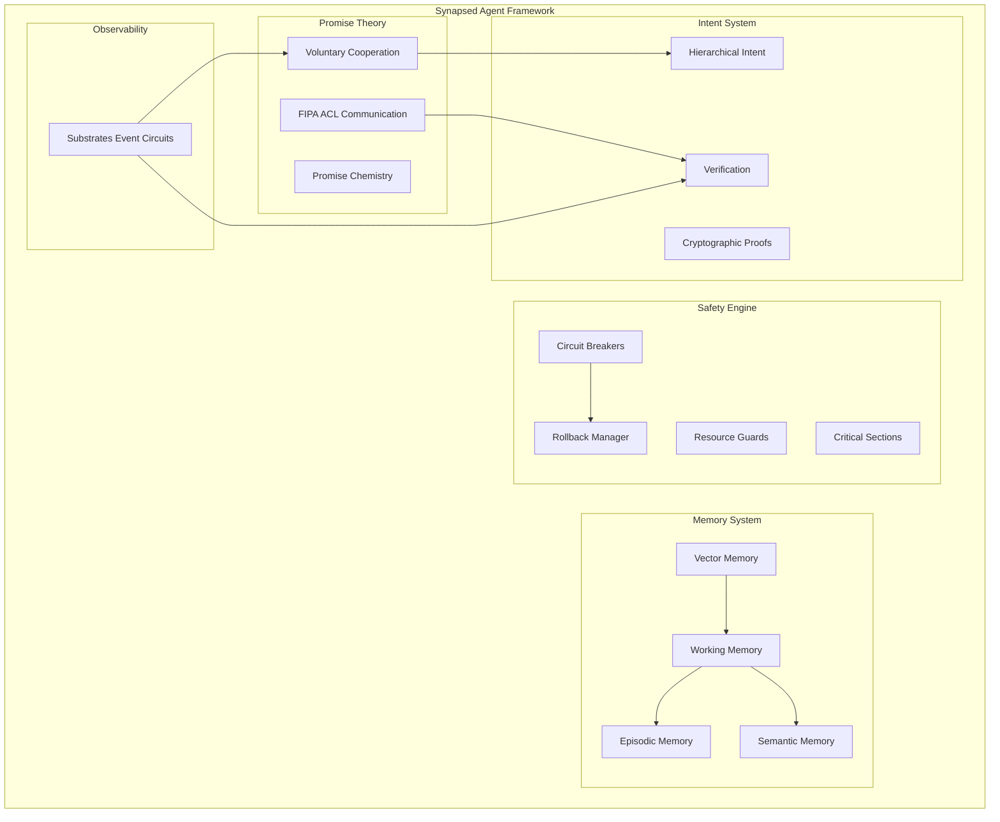

# Synapsed 🧠

> **Next-Generation Distributed Agent Framework** - Verifiable, Autonomous, and Safety-First AI Agent Systems

[](https://crates.io/crates/synapsed-core)
[](https://docs.rs/synapsed-core)
[](LICENSE)
[](https://github.com/synapsed-me/synapsed/actions)

## 🚀 Overview

Synapsed is a comprehensive Rust framework for building **verifiable, autonomous AI agent systems** with mathematical safety guarantees. It prevents AI agents from context escaping, making false claims, and ensures all actions are verifiable against external reality.

### Core Capabilities

- **🤝 Promise Theory Implementation**: True voluntary cooperation between autonomous agents
- **🧠 Hybrid Memory Architecture**: Vector, episodic, semantic, and working memory systems
- **✅ Intent Verification**: Hierarchical intent trees with cryptographic proofs
- **🛡️ Safety Integration**: Mathematical safety guarantees with automatic rollback
- **💬 FIPA ACL Communication**: Semantic agent messaging with conversation management
- **🔒 Adaptive Permissions**: Trust-based permission negotiation with learning
- **🔌 Claude Code Integration**: Native hooks and MCP server support
- **🔐 Post-Quantum Security**: Kyber and Dilithium implementations

## 🏗️ Architecture



## 🎯 Key Features

### Promise Theory Implementation
- **Voluntary Cooperation**: Agents cannot be coerced, only make voluntary promises
- **Causal Independence**: Mathematical verification of agent autonomy
- **Semantic Spacetime**: Promises with spatial, temporal, and semantic contexts
- **Promise Chemistry**: How promises interact, compose, and transform

### Intent Verification System
- **Hierarchical Intent Trees**: Complex multi-step planning with verification
- **Cryptographic Proofs**: Tamper-proof evidence of execution
- **Multi-Strategy Verification**: Command, filesystem, API, and composite verification
- **Context Boundaries**: Strict enforcement of operational limits

### Memory Architecture
- **Vector Memory**: 768-dimensional embeddings with cosine similarity search
- **Episodic Memory**: Sequential event storage with temporal indexing
- **Semantic Memory**: Knowledge graphs with relationship inference
- **Working Memory**: Attention-based active context management
- **Memory Consolidation**: Automatic transfer between memory types

### Safety & Permissions
- **Adaptive Trust Scoring**: Trust evolves based on agent behavior
- **Learning Engine**: Discovers successful permission patterns
- **Circuit Breakers**: Prevents cascade failures in multi-agent systems
- **Resource Guards**: Automatic cleanup and leak prevention
- **Hierarchical Delegation**: Permission escalation chains

## 📦 Core Crates

### Agent Framework
- **[synapsed-intent](crates/intent/synapsed-intent)** - Hierarchical intent trees with verification
- **[synapsed-promise](crates/intent/synapsed-promise)** - Promise Theory implementation
- **[synapsed-verify](crates/intent/synapsed-verify)** - Multi-strategy verification
- **[synapsed-mcp](crates/application/synapsed-mcp)** - Model Context Protocol server

### Core Infrastructure
- **[synapsed-core](crates/core/synapsed-core)** - Base traits and utilities
- **[synapsed-crypto](crates/core/synapsed-crypto)** - Post-quantum cryptography
- **[synapsed-substrates](crates/observability/synapsed-substrates)** - Event circuits

### Safety & Security
- **[synapsed-safety](crates/security/synapsed-safety)** - Mathematical safety guarantees
- **[synapsed-identity](crates/security/synapsed-identity)** - DIDs and authentication

### Storage & Network
- **[synapsed-storage](crates/storage/synapsed-storage)** - Multi-backend storage
- **[synapsed-net](crates/network/synapsed-net)** - P2P and secure networking

## 🚀 Quick Start

### Installation

```toml
[dependencies]
synapsed-intent = "0.1"
synapsed-promise = "0.1"
synapsed-verify = "0.1"
```

### Basic Agent with Promise Theory

```rust
use synapsed_promise::{AutonomousAgent, Promise, PromiseType, Willingness};
use synapsed_intent::{HierarchicalIntent, IntentBuilder};

#[tokio::main]
async fn main() -> Result<(), Box<dyn std::error::Error>> {
    // Create an autonomous agent
    let agent = AutonomousAgent::new(config);
    agent.initialize().await?;
    
    // Evaluate willingness before making a promise
    let willingness = agent.evaluate_willingness(
        &promise_type,
        &body,
        &context
    ).await?;
    
    if matches!(willingness, Willingness::Willing { .. }) {
        // Make a voluntary promise
        let promise = agent.make_promise(
            PromiseType::Offer,
            scope,
            body
        ).await?;
        
        // Execute with verification
        let intent = IntentBuilder::new("Complete task")
            .add_step("Verify preconditions")
            .add_step("Execute action")
            .add_step("Verify postconditions")
            .build()?;
            
        let result = executor.execute_with_verification(&intent).await?;
    }
    
    Ok(())
}
```

### Claude Code Integration

Add to `.claude/hooks.json`:

```json
{
  "hooks": {
    "PreToolUse": [{
      "name": "intent-declaration",
      "matcher": "Write|Edit",
      "hooks": [{
        "type": "command",
        "command": "cargo run --bin synapsed-mcp -- intent declare"
      }]
    }],
    "PostToolUse": [{
      "name": "intent-verification",
      "matcher": ".*",
      "hooks": [{
        "type": "command",
        "command": "cargo run --bin synapsed-mcp -- intent verify"
      }]
    }]
  }
}
```

## 📚 Documentation

- [Integration Guide](docs/INTEGRATION_GUIDE.md) - Complete integration patterns
- [Intent Verification](docs/intent-verification/) - Intent system documentation
- [API Documentation](https://docs.rs/synapsed-core) - Full API reference
- [Examples](examples/) - Working examples

## 🛠️ Development

### Building

```bash
# Build all crates
cargo build --all

# Run tests
cargo test --all --all-features

# Run benchmarks
cargo bench --all
```

### Testing

```bash
# Unit tests
cargo test

# Integration tests
cargo test --test '*'

# With all features
cargo test --all-features
```

## 🔒 Security

This framework implements:
- **Post-quantum cryptography** (Kyber, Dilithium)
- **Cryptographic proof generation** for all verifications
- **Context boundary enforcement** to prevent escaping
- **Mathematical safety guarantees** through formal verification

## 🤝 Contributing

See [CONTRIBUTING.md](CONTRIBUTING.md) for guidelines.

## 📄 License

Licensed under either of:
- Apache License, Version 2.0 ([LICENSE-APACHE](LICENSE-APACHE))
- MIT license ([LICENSE-MIT](LICENSE-MIT))

## 🙏 Acknowledgments

- Mark Burgess for Promise Theory
- William Louth and Humainary for Substrates observability
- FIPA for Agent Communication Language standards
- The Rust community for excellent tooling

## 📮 Contact

- GitHub: [https://github.com/synapsed-me/synapsed](https://github.com/synapsed-me/synapsed)
- Issues: [https://github.com/synapsed-me/synapsed/issues](https://github.com/synapsed-me/synapsed/issues)