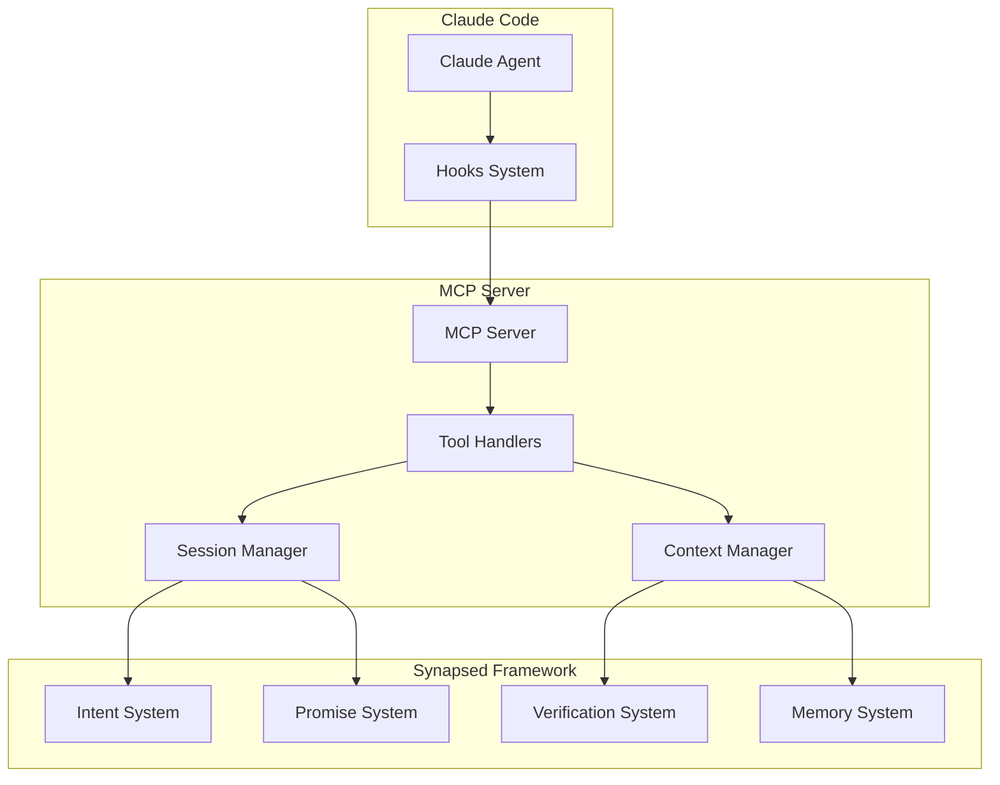

# Synapsed MCP

Model Context Protocol server for AI agent integration with intent verification and management.

## Overview

This crate provides an MCP (Model Context Protocol) server that enables AI agents like Claude to declare intents, verify execution, manage context, and spawn sub-agents with proper boundaries. It serves as the bridge between AI models and the Synapsed framework.

## Features

### MCP Tools
- **intent_declare**: Declare intentions before execution
- **intent_verify**: Verify execution against declarations
- **intent_status**: Query intent execution status
- **context_inject**: Pass context to sub-agents
- **context_query**: Retrieve current context information
- **agent_spawn**: Create sub-agents with boundaries
- **agent_status**: Monitor agent health and activity
- **trust_check**: Query agent trust levels
- **memory_store**: Store information in hybrid memory
- **memory_query**: Search and retrieve from memory
- **permission_request**: Request additional permissions
- **session_start**: Initialize new agent session
- **session_end**: Cleanup and finalize session

### Claude Code Integration
- Native hooks support (PreToolUse, PostToolUse, Task, Session)
- Automatic intent capture from tool usage
- Context preservation across sub-agent spawning
- Trust-based permission negotiation

## Architecture



## Installation

```bash
cargo install synapsed-mcp
```

## Usage

### Starting the MCP Server

```bash
# Run as MCP server
synapsed-mcp serve --port 8080

# Run with custom config
synapsed-mcp serve --config mcp-config.toml

# Run in development mode with verbose logging
RUST_LOG=debug synapsed-mcp serve --dev
```

### Claude Code Hooks Configuration

Add to `.claude/hooks.json`:

```json
{
  "hooks": {
    "PreToolUse": [{
      "name": "intent-declaration",
      "matcher": "Write|Edit|MultiEdit|Bash",
      "hooks": [{
        "type": "command",
        "command": "synapsed-mcp intent declare --tool {{tool}} --params '{{params}}'"
      }]
    }],
    "PostToolUse": [{
      "name": "intent-verification",
      "matcher": ".*",
      "hooks": [{
        "type": "command",
        "command": "synapsed-mcp intent verify --tool {{tool}} --result '{{result}}'"
      }]
    }],
    "Task": [{
      "name": "sub-agent-spawn",
      "matcher": ".*",
      "hooks": [{
        "type": "command",
        "command": "synapsed-mcp agent spawn --task '{{task}}' --context '{{context}}'"
      }]
    }],
    "Session": [{
      "name": "session-lifecycle",
      "matcher": "start|end",
      "hooks": [{
        "type": "command",
        "command": "synapsed-mcp session {{event}} --id {{session_id}}"
      }]
    }]
  }
}
```

### Programmatic Usage

```rust
use synapsed_mcp::{MCPServer, MCPConfig, ToolHandler};

#[tokio::main]
async fn main() -> Result<(), Box<dyn std::error::Error>> {
    // Configure server
    let config = MCPConfig {
        port: 8080,
        host: "127.0.0.1".to_string(),
        max_connections: 100,
        session_timeout: Duration::from_secs(3600),
        enable_metrics: true,
    };
    
    // Create and start server
    let server = MCPServer::new(config);
    
    // Register custom tool handlers
    server.register_tool(
        "custom_tool",
        Box::new(CustomToolHandler::new())
    );
    
    // Start serving
    server.serve().await?;
    
    Ok(())
}
```

### Intent Declaration and Verification

```rust
use synapsed_mcp::client::{MCPClient, IntentDeclaration};

let client = MCPClient::connect("http://localhost:8080").await?;

// Declare intent
let declaration = IntentDeclaration {
    goal: "Process user data".to_string(),
    steps: vec![
        "Validate input",
        "Transform data",
        "Save output"
    ],
    bounds: ContextBounds {
        allowed_paths: vec!["/workspace"],
        allowed_commands: vec!["python", "node"],
        max_memory_mb: 512,
    },
};

let intent_id = client.declare_intent(declaration).await?;

// Execute with verification
let result = client.execute_verified(intent_id, || async {
    // Actual execution code
    process_data().await
}).await?;

// Check verification status
let status = client.verify_intent(intent_id).await?;
assert!(status.is_verified);
```

### Context Injection for Sub-Agents

```rust
// Spawn sub-agent with context
let sub_agent = client.spawn_agent(
    "data-processor",
    Context {
        parent_intent: intent_id,
        variables: hashmap!{
            "input_file" => "/data/input.json",
            "output_dir" => "/data/output/"
        },
        bounds: restricted_bounds,
        trust_level: 0.7,
    }
).await?;

// Monitor sub-agent
let status = client.agent_status(sub_agent.id).await?;
```

### Memory Operations

```rust
// Store in memory
client.memory_store(
    MemoryItem {
        content: "Important fact about the system",
        category: MemoryCategory::Semantic,
        tags: vec!["system", "configuration"],
        embedding: Some(embedding_vector),
    }
).await?;

// Query memory
let results = client.memory_query(
    "How do I configure the system?",
    MemoryCategory::All,
    5  // top 5 results
).await?;
```

### Permission Negotiation

```rust
// Request additional permissions
let request = PermissionRequest {
    additional_commands: vec!["git"],
    additional_paths: vec!["/repo"],
    justification: "Need git access for version control",
    priority: Priority::Normal,
};

let response = client.request_permission(request).await?;
match response.decision {
    Decision::Approved => {
        // Use new permissions
    },
    Decision::PartiallyApproved { granted } => {
        // Work with reduced permissions
    },
    Decision::Denied { reason } => {
        // Handle denial
    }
}
```

## Configuration

### Server Configuration (mcp-config.toml)

```toml
[server]
host = "127.0.0.1"
port = 8080
max_connections = 100

[session]
timeout_seconds = 3600
max_sessions = 50
cleanup_interval_seconds = 300

[security]
require_auth = false
allowed_origins = ["*"]
rate_limit_per_minute = 100

[intent]
max_steps = 100
verification_timeout_seconds = 30
enable_rollback = true

[memory]
max_items = 10000
consolidation_interval_seconds = 600
embedding_dimension = 768

[permissions]
default_trust_score = 0.5
trust_decay_rate = 0.1
learning_enabled = true
```

## MCP Protocol Extensions

This implementation extends the standard MCP protocol with:

1. **Intent Management**: Tools for declaring and verifying intents
2. **Context Boundaries**: Enforcement of operational limits
3. **Trust Scoring**: Reputation-based permission management
4. **Memory Integration**: Hybrid memory system access
5. **Agent Lifecycle**: Session and sub-agent management

## Testing

```bash
# Run tests
cargo test

# Integration tests with mock Claude
cargo test --test integration

# Stress testing
cargo bench
```

## License

Licensed under either of:
- Apache License, Version 2.0
- MIT license