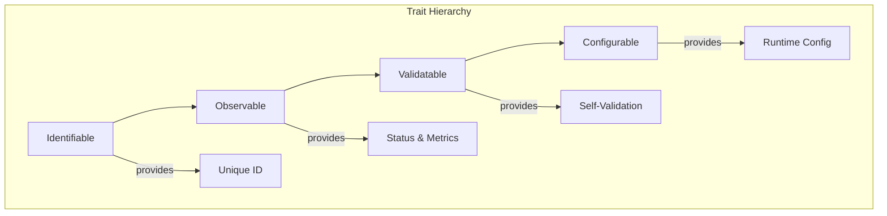

# Synapsed Core

Core infrastructure providing base traits, utilities, and runtime for the Synapsed framework.

## Overview

This crate provides the foundational components that all other Synapsed crates build upon. It defines the core trait hierarchy, memory management primitives, runtime abstractions, and common utilities.

## Key Components

### Core Traits



### Base Traits

```rust
use synapsed_core::{Identifiable, Observable, Validatable, Configurable};

// All major components implement these traits
pub struct Agent {
    id: Uuid,
    config: AgentConfig,
}

impl Identifiable for Agent {
    fn id(&self) -> &Uuid { &self.id }
}

impl Observable for Agent {
    async fn status(&self) -> Status { /* ... */ }
    async fn health(&self) -> Health { /* ... */ }
    async fn metrics(&self) -> Metrics { /* ... */ }
}

impl Validatable for Agent {
    async fn validate(&self) -> Result<(), ValidationError> { /* ... */ }
}

impl Configurable for Agent {
    type Config = AgentConfig;
    fn configure(&mut self, config: Self::Config) { /* ... */ }
}
```

### Memory Management

```rust
use synapsed_core::memory::{MemoryPool, SharedBuffer, Arena};

// Efficient memory pooling
let pool = MemoryPool::new(1024 * 1024); // 1MB pool
let buffer = pool.allocate(4096)?;

// Zero-copy shared buffers
let shared = SharedBuffer::from_vec(data);
let view = shared.slice(0..100);

// Arena allocation for temporary objects
let arena = Arena::new();
let obj = arena.alloc(MyStruct::new());
```

### Runtime Abstractions

```rust
use synapsed_core::runtime::{Runtime, Task, Executor};

// Async runtime management
let runtime = Runtime::new()
    .worker_threads(4)
    .enable_io()
    .enable_time();

// Task spawning
runtime.spawn(async {
    // Async work
});

// Custom executors
let executor = Executor::new()
    .max_concurrent_tasks(100)
    .task_queue_size(1000);
```

### Error Handling

```rust
use synapsed_core::{Error, Result, ErrorKind};

// Unified error type
fn process() -> Result<()> {
    operation()
        .map_err(|e| Error::new(ErrorKind::InvalidInput, e))?;
    Ok(())
}

// Error context
operation()
    .context("Failed to process data")?;
```

## Integration Patterns

### With Intent System

```rust
use synapsed_core::{Identifiable, Observable};
use synapsed_intent::HierarchicalIntent;

impl Identifiable for HierarchicalIntent {
    fn id(&self) -> &Uuid { &self.id.0 }
}

impl Observable for HierarchicalIntent {
    async fn status(&self) -> Status {
        self.status.read().await.clone()
    }
}
```

### With Promise Theory

```rust
use synapsed_core::{Validatable};
use synapsed_promise::Promise;

impl Validatable for Promise {
    async fn validate(&self) -> Result<(), ValidationError> {
        // Validate promise constraints
        self.validate_constraints().await?;
        self.validate_scope().await?;
        Ok(())
    }
}
```

### With Observability

```rust
use synapsed_core::Observable;
use synapsed_substrates::Subject;

// All subjects are observable
impl<T> Observable for Subject<T> {
    async fn metrics(&self) -> Metrics {
        Metrics {
            events_emitted: self.emission_count(),
            active_subscriptions: self.subscription_count(),
        }
    }
}
```

## Utilities

### UUID Management

```rust
use synapsed_core::uuid::{Uuid, UuidGenerator};

let gen = UuidGenerator::new();
let id = gen.next(); // Time-ordered UUID
```

### Time Utilities

```rust
use synapsed_core::time::{Clock, Duration, Instant};

let clock = Clock::system();
let now = clock.now();
let deadline = now + Duration::from_secs(30);
```

### Serialization

```rust
use synapsed_core::serde::{Serialize, Deserialize};

#[derive(Serialize, Deserialize)]
struct Message {
    id: Uuid,
    content: String,
}
```

## Configuration

```rust
use synapsed_core::config::{Config, ConfigBuilder};

let config = ConfigBuilder::new()
    .set("max_memory_mb", 1024)
    .set("worker_threads", 4)
    .set("enable_metrics", true)
    .build()?;
```

## Performance Considerations

- **Zero-cost abstractions**: Traits compile to efficient code
- **Memory pooling**: Reduces allocation overhead
- **Async-first design**: Built for concurrent systems
- **SIMD support**: Vectorized operations where applicable

## Testing

```bash
cargo test
cargo test --all-features
cargo bench
```

## Features

- `default`: Standard features
- `async`: Async runtime support (enabled by default)
- `metrics`: Metrics collection
- `tracing`: Distributed tracing support
- `no_std`: Core functionality without std

## License

Licensed under either of:
- Apache License, Version 2.0
- MIT license