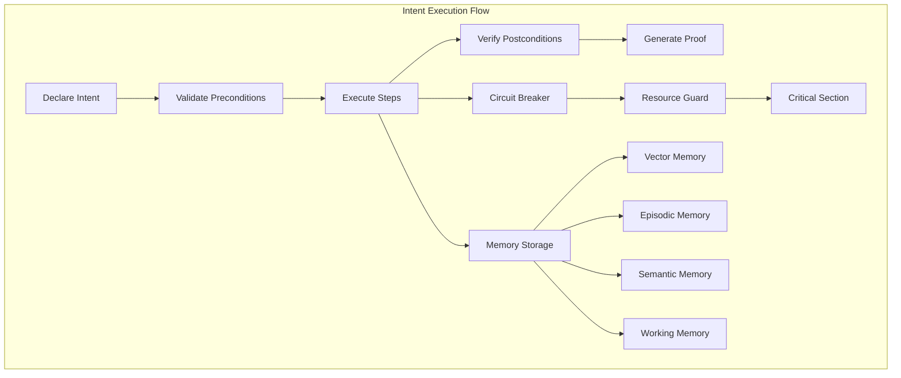
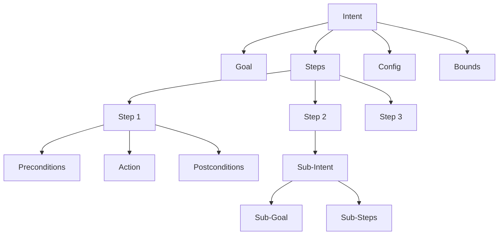

# Synapsed Intent

Hierarchical intent trees with verification for AI agent systems.

## Overview

This crate implements HTN (Hierarchical Task Network) planning with observable execution, providing a framework for AI agents to declare, execute, and verify their intentions. It includes memory architecture, adaptive permissions, and safety integration.

## Key Features

### Hierarchical Intent Trees
- Complex multi-step planning with sub-intents
- Preconditions and postconditions for each step
- Dependency management between steps
- Rollback and recovery strategies

### Memory Architecture
- **Vector Memory**: 768-dimensional embeddings with similarity search
- **Episodic Memory**: Sequential experience storage with temporal indexing
- **Semantic Memory**: Knowledge graphs with relationship inference
- **Working Memory**: Attention-based active context management
- **Memory Consolidation**: Automatic transfer between memory types

### Adaptive Permission System
- Trust scoring that evolves based on behavior
- Learning engine for pattern discovery
- Hierarchical delegation chains
- Context-aware decision making

### Safety Integration
- Circuit breaker patterns for failure prevention
- Resource guards for automatic cleanup
- Critical sections for atomic operations
- Integration with synapsed-safety for formal verification

## Implementation Status

- ✅ Hierarchical intent trees
- ✅ Intent validation and verification
- ✅ Context boundaries
- ✅ Checkpoint management
- ✅ Observable execution
- ✅ Permission negotiation
- ✅ Tool discovery
- 🚧 Safe execution module
- 📋 Machine learning optimization

## Architecture



## Usage

### Basic Intent Creation

```rust
use synapsed_intent::{HierarchicalIntent, IntentBuilder, Step, StepAction};

let intent = IntentBuilder::new("Process data file")
    .add_step(Step::new(
        "Validate input",
        StepAction::Command("validate_file input.json".to_string())
    ))
    .add_step(Step::new(
        "Transform data",
        StepAction::Function("transform_data".to_string())
    ))
    .add_step(Step::new(
        "Save output",
        StepAction::Command("save_output output.json".to_string())
    ))
    .with_precondition(Condition::file_exists("input.json"))
    .with_postcondition(Condition::file_exists("output.json"))
    .build()?;
```

### Verified Execution

```rust
use synapsed_intent::{VerifiedExecutor, SafeVerifiedExecutor};

// Basic verified execution
let executor = VerifiedExecutor::new();
let result = executor.execute_with_verification(&intent).await?;

// Safe execution with circuit breakers and rollback
let safe_executor = SafeVerifiedExecutor::new(executor).await?;
let result = safe_executor.execute_safe(&intent).await?;

// Critical section for atomic operations
let result = safe_executor.execute_critical(
    &intent,
    Duration::from_secs(30)
).await?;
```

### Memory Management

```rust
use synapsed_intent::{HybridMemory, MemoryItem, MemoryContent};

let memory = HybridMemory::new();

// Store in vector memory
let embedding = vec![0.1; 768]; // 768-dimensional
let item = MemoryItem {
    id: Uuid::new_v4(),
    content: MemoryContent::Intent { 
        intent_id, 
        goal, 
        status, 
        result 
    },
    timestamp: Utc::now(),
    importance_score: 0.8,
    // ...
};
memory.vector.store(embedding, item).await?;

// Search similar items
let similar = memory.vector.search(&query_embedding, 5).await;

// Store episodic memory
let episode = Episode {
    id: Uuid::new_v4(),
    timestamp: Utc::now(),
    events: vec![event],
    outcome: EpisodeOutcome::Success,
    importance: 0.9,
};
memory.episodic.add_episode(episode).await?;

// Consolidate working memory to long-term
memory.consolidate().await?;
```

### Adaptive Permissions

```rust
use synapsed_intent::{
    AdaptivePermissionNegotiator,
    PermissionRequest,
    RequestedPermissions,
    Priority
};

let negotiator = AdaptivePermissionNegotiator::new(
    base_negotiator,
    memory
);

let request = PermissionRequest {
    request_id: Uuid::new_v4(),
    agent_id: "agent_123".to_string(),
    requested_permissions: RequestedPermissions {
        additional_commands: vec!["git".to_string()],
        additional_paths: vec!["/workspace".to_string()],
        increased_memory_mb: Some(512),
        // ...
    },
    justification: "Need git for version control".to_string(),
    priority: Priority::Normal,
    // ...
};

let response = negotiator.process_adaptive_request(request).await?;

match response.decision {
    Decision::Approved => {
        // Use granted permissions
    },
    Decision::PartiallyApproved => {
        // Work with reduced permissions
    },
    Decision::Denied => {
        // Try alternatives
    },
    _ => {}
}

// Update trust based on outcome
negotiator.update_from_outcome(
    request_id,
    DecisionOutcome {
        was_correct: true,
        actual_usage,
        violations: vec![],
        feedback: None,
    }
).await?;
```

### Dynamic Agent Management

```rust
use synapsed_intent::{
    DynamicContextGenerator,
    SubAgentDefinition,
    AgentMarkdownParser
};

// Parse agent from markdown
let parser = AgentMarkdownParser::new();
let agent_def = parser.parse_file("agents/code_reviewer.md").await?;

// Generate secure context
let generator = DynamicContextGenerator::new();
let context = generator.generate_context_from_agent_definition(
    &agent_def,
    trust_level
).await?;

// Profile agent behavior
let profiling = AgentProfilingSystem::new();
let profile = profiling.profile_agent(&agent_def).await?;

// Detect anomalies
let anomalies = profiling.detect_anomalies(
    agent_id,
    current_tools,
    resource_usage
).await;
```

## Intent Structure



## Testing

```bash
cargo test
cargo test --all-features
cargo bench
```

## Features

- `default`: Basic intent functionality
- `observable`: Integration with Substrates observability
- `memory`: Full memory architecture
- `safety`: Safety engine integration

## License

Licensed under either of:
- Apache License, Version 2.0
- MIT license