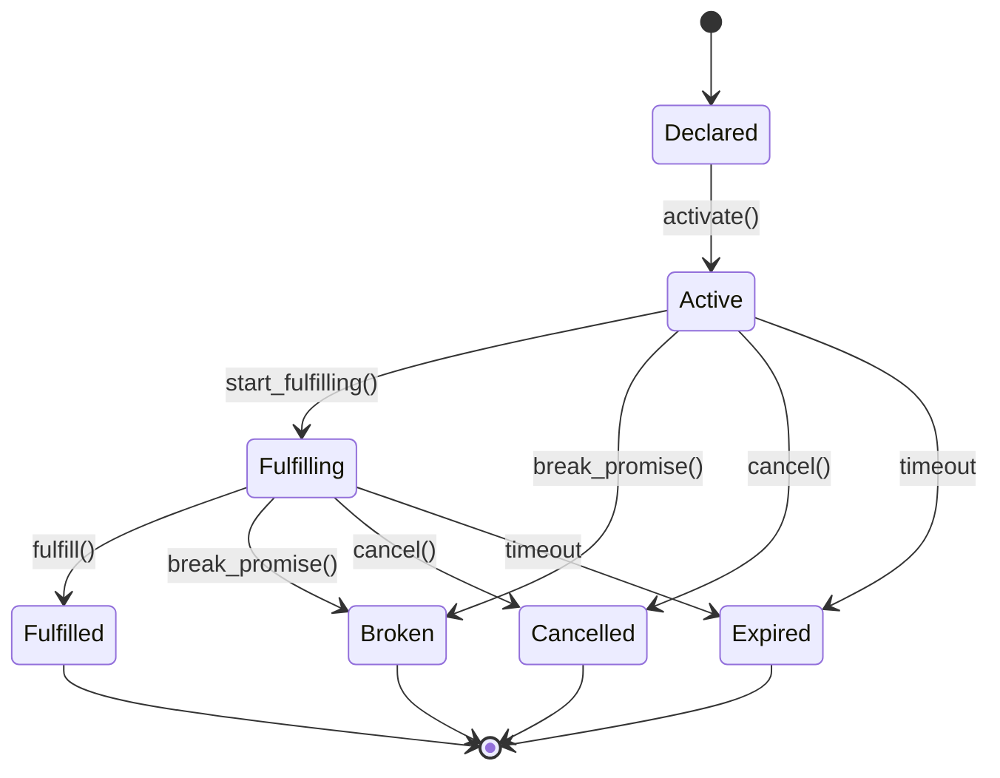

# Synapsed Promise

Promise Theory implementation for autonomous agent cooperation and verification.

## Overview

This crate implements Mark Burgess's Promise Theory, providing a framework for voluntary cooperation between autonomous agents that cannot be coerced. It includes FIPA ACL communication standards for semantic agent messaging.

## Key Concepts

### Promise Theory Principles
- **Autonomy**: Agents are causally independent and self-determined
- **Voluntary Cooperation**: All cooperation is voluntary, agents cannot be coerced
- **Promises vs Impositions**: External expectations must be accepted to become promises
- **Trust**: Reputation-based trust model for agent cooperation

### FIPA ACL Communication
- **Performatives**: Semantic message types (Inform, Request, Agree, Refuse, etc.)
- **Conversation Management**: Multi-turn dialogue state tracking
- **Interaction Protocols**: Contract Net, Request-Response, Subscribe-Notify

## Features

### Core Promise Implementation
- Promise lifecycle management (Declared → Active → Fulfilling → Fulfilled/Broken)
- Promise contracts with preconditions, postconditions, and invariants
- Imposition handling and voluntary acceptance
- Assessment and reputation tracking

### Voluntary Cooperation Protocol
- Willingness evaluation before making promises
- Causal independence verification
- Semantic spacetime contexts (spatial, temporal, semantic)
- Promise chemistry (compose, decompose, catalyze, inhibit, transform)

### Agent Communication (FIPA ACL)
- Full set of FIPA performatives for semantic messaging
- Message builder for ergonomic creation
- Conversation state management
- Standard interaction protocols

## Implementation Status

- ✅ Promise Theory implementation
- ✅ Autonomous agent framework
- ✅ Trust model
- ✅ Voluntary cooperation
- ✅ FIPA ACL integration
- 🚧 Advanced trust metrics
- 📋 Distributed promise consensus
- 📋 Observability integration

## Usage

### Basic Promise Making

```rust
use synapsed_promise::{
    AutonomousAgent, Promise, PromiseType, PromiseScope,
    PromiseBody, Willingness, VoluntaryCooperationEvaluator
};

#[tokio::main]
async fn main() -> Result<(), Box<dyn std::error::Error>> {
    // Create autonomous agent
    let agent = AutonomousAgent::new(config);
    agent.initialize().await?;
    
    // Evaluate willingness before making a promise
    let evaluator = DefaultVoluntaryEvaluator::new();
    let willingness = evaluator.evaluate_promise_willingness(
        agent.id(),
        &PromiseType::Offer,
        &body,
        &context
    ).await?;
    
    match willingness {
        Willingness::Willing { confidence } => {
            // Make voluntary promise
            let promise = agent.make_promise(
                PromiseType::Offer,
                PromiseScope::Universal,
                body
            ).await?;
            
            // Activate and fulfill
            promise.activate().await?;
            promise.start_fulfilling().await?;
            
            // ... perform work ...
            
            promise.fulfill(evidence).await?;
        },
        Willingness::Conditional { conditions, confidence } => {
            // Negotiate conditions
            let negotiated = evaluator.negotiate_conditions(
                conditions,
                counterparty
            ).await?;
        },
        Willingness::Unwilling { reason } => {
            // Cannot make this promise
            println!("Unwilling: {}", reason);
        },
        _ => {}
    }
    
    Ok(())
}
```

### Agent Communication with FIPA ACL

```rust
use synapsed_promise::{
    ACLMessageBuilder, Performative, InteractionProtocol,
    ConversationManager, MessageContent
};

// Create conversation manager
let mut manager = ConversationManager::new();

// Start conversation
let conv_id = manager.start_conversation(
    initiator,
    participants,
    InteractionProtocol::ContractNet
);

// Build and send message
let message = ACLMessageBuilder::new()
    .performative(Performative::Request)
    .sender(agent_id)
    .receiver(target_agent)
    .content(MessageContent::Text("Please perform task X"))
    .conversation(conv_id.clone())
    .protocol(InteractionProtocol::RequestResponse)
    .build()?;

// Add to conversation
manager.add_message(&conv_id, message)?;

// Handle response
let response = ACLMessageBuilder::new()
    .performative(Performative::Agree)
    .sender(target_agent)
    .receiver(agent_id)
    .content(MessageContent::Promise(promise_body))
    .conversation(conv_id)
    .build()?;
```

### Handling Impositions

```rust
use synapsed_promise::{Imposition, Promise};

// Receive imposition from another agent
let imposition = Imposition {
    id: Uuid::new_v4(),
    from: imposer_agent,
    to: our_agent,
    body: promise_body,
    timestamp: Utc::now(),
};

// Evaluate willingness to accept
let willingness = evaluator.evaluate_imposition_willingness(
    our_agent.id(),
    &imposition,
    imposer_trust_score
).await?;

if matches!(willingness, Willingness::Willing { .. }) {
    // Accept imposition as promise
    let promise = Promise::from_imposition(
        our_agent.id(),
        imposition
    );
    
    // Now it's our voluntary promise
    promise.activate().await?;
}
```

## Promise States



## Trust Model

The trust model tracks agent reputation based on promise fulfillment:

```rust
use synapsed_promise::{TrustModel, TrustLevel};

let mut trust_model = TrustModel::new();

// Update trust based on promise outcome
if promise_fulfilled {
    trust_model.increase_trust(agent_id, 0.1).await?;
} else {
    trust_model.decrease_trust(agent_id, 0.2).await?;
}

// Check trust level
let level = trust_model.get_trust_level(agent_id).await?;
match level {
    TrustLevel::Trusted => {
        // High trust operations allowed
    },
    TrustLevel::Neutral => {
        // Standard operations
    },
    TrustLevel::Untrusted => {
        // Restricted operations only
    }
}
```

## Semantic Spacetime

Promises can have spatial, temporal, and semantic contexts:

```rust
use synapsed_promise::{SemanticSpacetime, SpatialScope, TemporalScope};

let spacetime = SemanticSpacetime {
    spatial_scope: SpatialScope::Network("local_network".to_string()),
    temporal_scope: TemporalScope {
        start: Some(Utc::now()),
        end: Some(Utc::now() + Duration::hours(1)),
        duration: Some(Duration::hours(1)),
        recurring: None,
    },
    semantic_context: SemanticContext {
        domain: "task_execution".to_string(),
        ontology: ontology_map,
        relationships: semantic_relationships,
    },
};
```

## Testing

```bash
cargo test
cargo test --all-features
cargo bench
```

## License

Licensed under either of:
- Apache License, Version 2.0
- MIT license

## References

- Mark Burgess, "Promise Theory: Principles and Applications"
- FIPA Agent Communication Language Specification
- "Thinking in Promises" by Mark Burgess