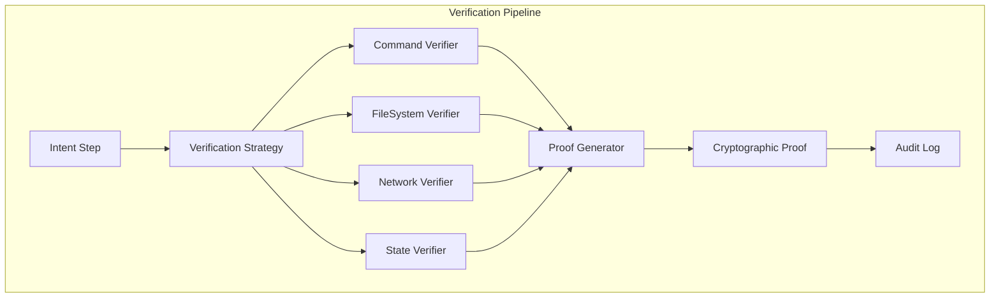

# Synapsed Verify

Multi-strategy verification system for AI agent claims and execution.

## Overview

This crate provides comprehensive verification strategies to ensure AI agents' claims are verifiable against external reality. It implements multiple verification approaches that can be composed for robust validation.

## Key Features

### Verification Strategies
- **Command Verification**: Sandboxed command execution with output validation
- **FileSystem Verification**: State snapshots, hash validation, diff tracking
- **Network Verification**: HTTP/API response validation with retry logic
- **State Verification**: System state validation and monitoring
- **Composite Verification**: Combine multiple strategies for comprehensive validation

### Cryptographic Proofs
- Post-quantum ready proof generation (using synapsed-crypto)
- Tamper-proof evidence chains
- State transition recording
- Non-repudiation guarantees

## Architecture



## Usage

### Basic Verification

```rust
use synapsed_verify::{
    CommandVerifier, FileSystemVerifier, NetworkVerifier,
    VerificationStrategy, CompositeVerifier
};

// Create individual verifiers
let cmd_verifier = CommandVerifier::new()
    .sandbox(true)
    .timeout(Duration::from_secs(30));

let fs_verifier = FileSystemVerifier::new()
    .track_hashes(true)
    .snapshot_enabled(true);

let net_verifier = NetworkVerifier::new()
    .retry_count(3)
    .timeout(Duration::from_secs(10));

// Compose verifiers
let composite = CompositeVerifier::new()
    .add_verifier(Box::new(cmd_verifier))
    .add_verifier(Box::new(fs_verifier))
    .add_verifier(Box::new(net_verifier));

// Verify an action
let result = composite.verify(&action, &expected_outcome).await?;
assert!(result.is_verified());
```

### Command Verification

```rust
use synapsed_verify::{CommandVerifier, CommandVerification};

let verifier = CommandVerifier::new()
    .sandbox(true)
    .allowed_commands(vec!["ls", "cat", "echo"])
    .working_directory("/tmp");

let verification = verifier.verify(
    "ls",
    Some(&["-la"]),
    Some(&json!({ "contains": "file.txt" }))
).await?;

match verification {
    CommandVerification::Success { output, proof, .. } => {
        println!("Command verified: {}", output);
        println!("Proof: {:?}", proof);
    },
    CommandVerification::Failed { reason, .. } => {
        eprintln!("Verification failed: {}", reason);
    }
}
```

### FileSystem Verification

```rust
use synapsed_verify::{FileSystemVerifier, FileSystemSnapshot};

let verifier = FileSystemVerifier::new();

// Take snapshot before operation
let snapshot_before = verifier.snapshot("/workspace").await?;

// Perform operation
perform_file_operations().await?;

// Take snapshot after
let snapshot_after = verifier.snapshot("/workspace").await?;

// Verify changes
let changes = verifier.diff(&snapshot_before, &snapshot_after)?;
for change in changes {
    match change {
        FileChange::Created(path) => println!("Created: {}", path),
        FileChange::Modified(path) => println!("Modified: {}", path),
        FileChange::Deleted(path) => println!("Deleted: {}", path),
    }
}

// Verify specific file
let is_valid = verifier.verify_file(
    "/workspace/output.json",
    expected_hash
).await?;
```

### Network Verification

```rust
use synapsed_verify::{NetworkVerifier, HttpVerification};

let verifier = NetworkVerifier::new()
    .allowed_hosts(vec!["api.example.com"])
    .require_https(true);

// Verify API response
let verification = verifier.verify_response(
    "https://api.example.com/data",
    &expected_schema,
    Some(&expected_headers)
).await?;

// Verify webhook delivery
let webhook_proof = verifier.verify_webhook_sent(
    "https://webhook.site/...",
    &payload,
    Duration::from_secs(5)
).await?;
```

### Proof Generation

```rust
use synapsed_verify::{ProofGenerator, VerificationProof};

let generator = ProofGenerator::new();

// Generate proof for verification
let proof = generator.generate_proof(
    &verification_result,
    &state_before,
    &state_after,
    &metadata
).await?;

// Verify proof authenticity
let is_valid = generator.verify_proof(&proof).await?;

// Store proof for audit
proof.store(&audit_log).await?;
```

## Verification Requirements

You can specify verification requirements for intent steps:

```rust
use synapsed_verify::{VerificationRequirement, VerificationLevel};

let requirement = VerificationRequirement {
    level: VerificationLevel::Strict,
    strategies: vec![
        VerificationStrategy::Command,
        VerificationStrategy::FileSystem,
    ],
    timeout: Duration::from_secs(60),
    retry_on_failure: true,
    max_retries: 3,
};
```

## Integration with Intent System

```rust
use synapsed_intent::{IntentBuilder, Step};
use synapsed_verify::VerificationRequirement;

let intent = IntentBuilder::new("Process data")
    .add_step(
        Step::new("Transform file", action)
            .with_verification(VerificationRequirement {
                strategies: vec![
                    VerificationStrategy::FileSystem,
                    VerificationStrategy::Command,
                ],
                level: VerificationLevel::Strict,
                ..Default::default()
            })
    )
    .build()?;
```

## Security Features

- **Sandboxed Execution**: Commands run in isolated environments
- **Path Traversal Prevention**: File operations restricted to allowed paths
- **Network Allowlisting**: Only permitted endpoints can be accessed
- **Cryptographic Integrity**: All proofs are cryptographically signed
- **Audit Trail**: Complete verification history with tamper detection

## Testing

```bash
cargo test
cargo test --all-features
cargo bench
```

## License

Licensed under either of:
- Apache License, Version 2.0
- MIT license