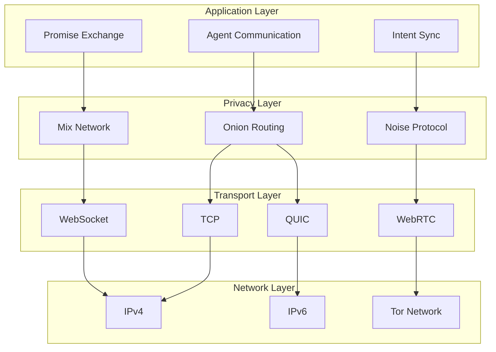

# Synapsed Net

Multi-transport networking layer with privacy features for distributed agent communication.

## Overview

This crate provides a comprehensive networking stack supporting multiple transport protocols, privacy layers, and secure communication patterns for the Synapsed framework. It enables agents to communicate across different network topologies while maintaining security and privacy.

## Implementation Status

- ✅ TCP transport layer
- ✅ WebSocket support
- ✅ QUIC implementation
- ✅ WebRTC data channels
- ✅ TLS 1.3 encryption
- ✅ Post-quantum crypto integration
- ✅ Compression (LZ4, Zstandard)
- ✅ Observability hooks ready
- 🚧 Tor integration
- 🚧 Mix network implementation
- 📋 libp2p full integration

## Features

### Transport Protocols
- **TCP**: Reliable stream communication
- **QUIC**: Low-latency, multiplexed streams
- **WebSocket**: Browser-compatible bidirectional communication
- **WebRTC**: P2P communication with NAT traversal
- **Unix Sockets**: High-performance local communication

### Privacy Layers
- **Onion Routing**: Multi-hop encrypted routing
- **Mix Networks**: Traffic analysis resistance
- **Noise Protocol**: Modern cryptographic handshake
- **Post-Quantum TLS**: Quantum-resistant encryption

### Communication Patterns
- **Request-Response**: Simple RPC-style communication
- **Publish-Subscribe**: Event-driven messaging
- **Streaming**: Continuous data flows
- **Broadcast**: One-to-many messaging
- **Mesh Networking**: Resilient peer-to-peer topology

## Architecture



## Usage

### Basic TCP Server

```rust
use synapsed_net::{TcpTransport, NetworkConfig, MessageHandler};

#[tokio::main]
async fn main() -> Result<(), Box<dyn std::error::Error>> {
    let config = NetworkConfig::default()
        .bind_address("127.0.0.1:8080")
        .max_connections(100);
    
    let transport = TcpTransport::new(config);
    
    transport.listen(|message| async {
        println!("Received: {:?}", message);
        // Handle message
    }).await?;
    
    Ok(())
}
```

### QUIC with Multiplexing

```rust
use synapsed_net::{QuicTransport, QuicConfig};

let config = QuicConfig::default()
    .certificate_path("cert.pem")
    .key_path("key.pem")
    .max_streams(100);

let transport = QuicTransport::new(config).await?;

// Open multiple streams
let stream1 = transport.open_stream("peer1").await?;
let stream2 = transport.open_stream("peer1").await?;

// Send data on different streams
stream1.send(b"data1").await?;
stream2.send(b"data2").await?;
```

### WebRTC P2P Connection

```rust
use synapsed_net::{WebRTCTransport, SignalingServer};

// Create WebRTC transport
let transport = WebRTCTransport::new();

// Connect to signaling server
let signaling = SignalingServer::connect("wss://signal.example.com").await?;

// Create peer connection
let peer = transport.connect_peer(
    "remote-peer-id",
    signaling
).await?;

// Send data
peer.send(b"Hello peer!").await?;

// Receive data
let data = peer.receive().await?;
```

### Privacy-Enhanced Communication

```rust
use synapsed_net::{OnionRouter, MixNetwork, PrivacyConfig};

// Onion routing for anonymous communication
let onion = OnionRouter::new()
    .add_hop("relay1.example.com:9001")
    .add_hop("relay2.example.com:9002")
    .add_hop("relay3.example.com:9003")
    .build()?;

let transport = TcpTransport::new(config)
    .with_privacy(onion);

// Mix network for traffic analysis resistance
let mix = MixNetwork::new()
    .batch_size(10)
    .delay_range(100..500) // milliseconds
    .dummy_traffic_rate(0.1);

let transport = transport.with_mix_network(mix);
```

### Noise Protocol Handshake

```rust
use synapsed_net::{NoiseProtocol, NoisePattern};

let noise = NoiseProtocol::new(NoisePattern::XX)
    .local_keypair(keypair)
    .remote_public_key(remote_key);

let secure_transport = transport.with_noise(noise);

// All communication is now encrypted
secure_transport.send(b"Secret message").await?;
```

### Publish-Subscribe Pattern

```rust
use synapsed_net::{PubSubTransport, Topic};

let pubsub = PubSubTransport::new(transport);

// Subscribe to topics
pubsub.subscribe("agent.events").await?;
pubsub.subscribe("intent.updates").await?;

// Publish messages
pubsub.publish("agent.events", b"Agent started").await?;

// Receive messages
let mut subscriber = pubsub.subscriber();
while let Some(message) = subscriber.next().await {
    println!("Topic: {}, Data: {:?}", message.topic, message.data);
}
```

### Mesh Networking

```rust
use synapsed_net::{MeshNetwork, MeshConfig};

let config = MeshConfig::default()
    .bootstrap_nodes(vec![
        "peer1.example.com:8080",
        "peer2.example.com:8080",
    ])
    .gossip_interval(Duration::from_secs(5))
    .redundancy_factor(3);

let mesh = MeshNetwork::new(config).await?;

// Join the mesh
mesh.join().await?;

// Broadcast to all peers
mesh.broadcast(b"Hello mesh!").await?;

// Direct message to specific peer
mesh.send_to("peer-id", b"Direct message").await?;
```

## Integration with Agent System

```rust
use synapsed_net::{AgentNetwork, NetworkedAgent};
use synapsed_promise::AutonomousAgent;

// Create networked agent
let agent = AutonomousAgent::new(agent_config);
let network = AgentNetwork::new(network_config);

let networked_agent = NetworkedAgent::new(agent, network);

// Agent can now communicate over network
networked_agent.broadcast_promise(promise).await?;
networked_agent.send_intent(peer_id, intent).await?;
```

## Security Features

### Post-Quantum TLS

```rust
use synapsed_net::{PQTlsConfig, KemAlgorithm};

let tls_config = PQTlsConfig::default()
    .kem_algorithm(KemAlgorithm::Kyber768)
    .signature_algorithm(SignatureAlgorithm::Dilithium3);

let transport = TcpTransport::new(config)
    .with_pq_tls(tls_config);
```

### Access Control

```rust
use synapsed_net::{AccessControl, Policy};

let acl = AccessControl::new()
    .allow_peer("trusted-peer-id")
    .deny_subnet("192.168.0.0/16")
    .rate_limit(100); // messages per second

let transport = transport.with_access_control(acl);
```

## Performance Optimization

### Connection Pooling

```rust
use synapsed_net::{ConnectionPool, PoolConfig};

let pool = ConnectionPool::new(PoolConfig {
    min_connections: 10,
    max_connections: 100,
    idle_timeout: Duration::from_secs(300),
});

let conn = pool.get_connection("peer-address").await?;
```

### Zero-Copy Serialization

```rust
use synapsed_net::{Message, ZeroCopyCodec};

let codec = ZeroCopyCodec::new();
let message = Message::new(data);

// Efficient serialization
let bytes = codec.encode(&message)?;

// Zero-copy deserialization
let decoded = codec.decode(bytes)?;
```

## Monitoring & Metrics

```rust
use synapsed_net::{NetworkMetrics, MetricsCollector};

let metrics = NetworkMetrics::new();
let transport = transport.with_metrics(metrics.clone());

// Query metrics
let stats = metrics.get_stats();
println!("Messages sent: {}", stats.messages_sent);
println!("Bytes received: {}", stats.bytes_received);
println!("Active connections: {}", stats.active_connections);
```

## Testing

```bash
# Run all tests
cargo test

# Integration tests
cargo test --test integration

# Benchmarks
cargo bench
```

## Features

- `default`: TCP and WebSocket support
- `quic`: QUIC protocol support
- `webrtc`: WebRTC support
- `privacy`: Onion routing and mix networks
- `pq-crypto`: Post-quantum cryptography
- `metrics`: Performance monitoring

## License

Licensed under either of:
- Apache License, Version 2.0
- MIT license