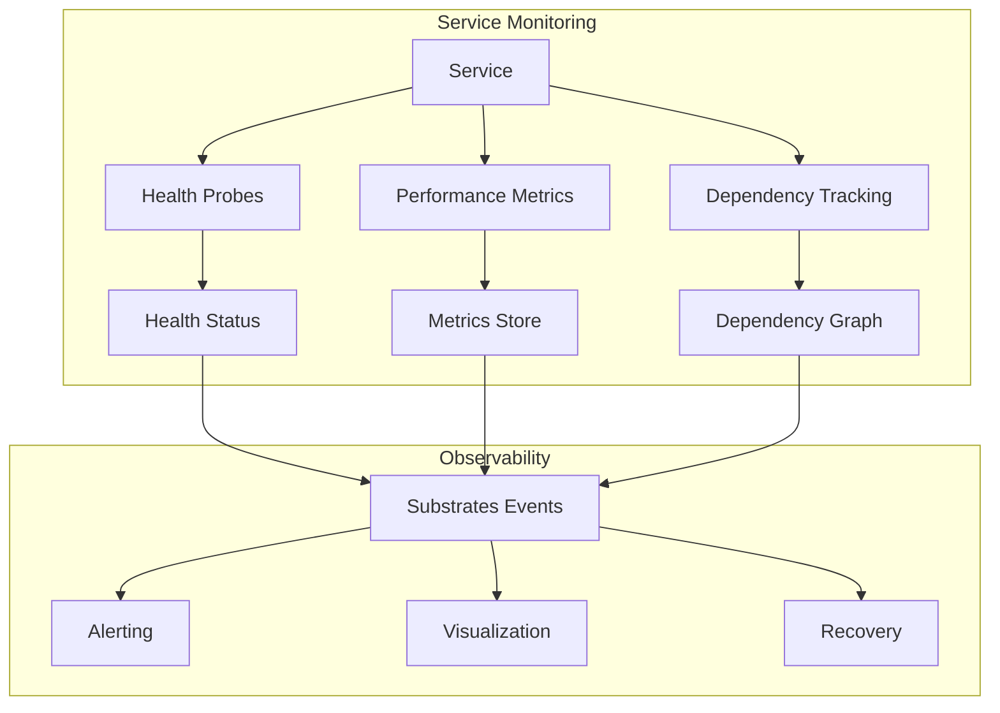

# Synapsed Serventis

Service-level monitoring and health probes for distributed systems.

## Overview

This crate provides comprehensive service monitoring capabilities built on top of Synapsed Substrates. It offers health checks, performance monitoring, dependency tracking, and automatic recovery mechanisms for microservices and distributed agents.

## Features

### Health Monitoring
- **Liveness Probes**: Detect if service is running
- **Readiness Probes**: Check if service can handle requests
- **Startup Probes**: Verify initialization completion
- **Custom Health Checks**: User-defined health criteria

### Performance Monitoring
- **Response Time Tracking**: P50, P95, P99 latencies
- **Throughput Metrics**: Requests per second
- **Error Rate Monitoring**: Success/failure ratios
- **Resource Usage**: CPU, memory, network, disk

### Dependency Management
- **Service Discovery**: Automatic dependency detection
- **Circuit Breaking**: Prevent cascade failures
- **Health Propagation**: Upstream/downstream health status
- **Dependency Graphs**: Visualize service relationships

## Architecture



## Usage

### Basic Service Monitoring

```rust
use synapsed_serventis::{Service, HealthProbe, ServiceMonitor};

#[tokio::main]
async fn main() -> Result<(), Box<dyn std::error::Error>> {
    // Define service
    let service = Service::new("user-api")
        .endpoint("http://localhost:8080")
        .version("1.0.0");
    
    // Create health probe
    let health_probe = HealthProbe::new()
        .liveness_check(|| async {
            // Check if process is alive
            check_process_health().await
        })
        .readiness_check(|| async {
            // Check if can handle requests
            check_database_connection().await &&
            check_cache_connection().await
        })
        .startup_check(|| async {
            // Check initialization
            check_migrations_complete().await
        });
    
    // Start monitoring
    let monitor = ServiceMonitor::new(service)
        .with_health_probe(health_probe)
        .with_interval(Duration::from_secs(10));
    
    monitor.start().await?;
    
    Ok(())
}
```

### Performance Metrics

```rust
use synapsed_serventis::{MetricsCollector, PerformanceMetrics};

let collector = MetricsCollector::new();

// Track request
let timer = collector.start_timer("api.request");
process_request().await?;
timer.stop();

// Record custom metrics
collector.record_gauge("queue.size", queue.len() as f64);
collector.increment_counter("requests.total");

// Query metrics
let metrics = collector.get_metrics();
println!("P95 latency: {}ms", metrics.percentile(95));
println!("Error rate: {:.2}%", metrics.error_rate() * 100.0);
```

### Dependency Tracking

```rust
use synapsed_serventis::{DependencyTracker, ServiceDependency};

let tracker = DependencyTracker::new();

// Register dependencies
tracker.add_dependency(ServiceDependency {
    name: "database",
    endpoint: "postgres://localhost:5432",
    critical: true,
    timeout: Duration::from_secs(5),
});

tracker.add_dependency(ServiceDependency {
    name: "cache",
    endpoint: "redis://localhost:6379",
    critical: false,
    timeout: Duration::from_secs(2),
});

// Check all dependencies
let health = tracker.check_all().await?;
if !health.is_healthy() {
    for failed in health.failed_dependencies() {
        log::error!("Dependency {} is unhealthy", failed.name);
    }
}
```

### Circuit Breaking

```rust
use synapsed_serventis::{CircuitBreaker, CircuitBreakerConfig};

let config = CircuitBreakerConfig {
    failure_threshold: 5,
    success_threshold: 2,
    timeout: Duration::from_secs(30),
    half_open_max_calls: 3,
};

let circuit = CircuitBreaker::new("external-api", config);

// Use circuit breaker
match circuit.call(|| async {
    call_external_api().await
}).await {
    Ok(result) => process_result(result),
    Err(CircuitBreakerError::Open) => {
        // Use fallback
        use_cached_data()
    },
    Err(e) => return Err(e.into()),
}
```

### Service Discovery

```rust
use synapsed_serventis::{ServiceRegistry, ServiceQuery};

let registry = ServiceRegistry::connect("consul://localhost:8500").await?;

// Register service
registry.register(Service {
    name: "payment-service",
    id: Uuid::new_v4(),
    address: "10.0.0.5",
    port: 8080,
    tags: vec!["production", "v2"],
    health_check_url: "/health",
}).await?;

// Discover services
let services = registry.query(ServiceQuery {
    name: Some("payment-service"),
    tags: vec!["production"],
    healthy_only: true,
}).await?;

for service in services {
    println!("Found: {}:{}", service.address, service.port);
}
```

### Alerting

```rust
use synapsed_serventis::{AlertManager, Alert, AlertSeverity};

let alert_manager = AlertManager::new()
    .add_channel("email", email_notifier)
    .add_channel("slack", slack_notifier)
    .add_channel("pagerduty", pagerduty_notifier);

// Define alert rules
alert_manager.add_rule(
    "high_error_rate",
    |metrics| metrics.error_rate() > 0.05,
    Alert {
        severity: AlertSeverity::Critical,
        message: "Error rate exceeds 5%",
        channels: vec!["pagerduty", "slack"],
    }
);

alert_manager.add_rule(
    "high_latency",
    |metrics| metrics.percentile(99) > 1000.0,
    Alert {
        severity: AlertSeverity::Warning,
        message: "P99 latency exceeds 1 second",
        channels: vec!["slack"],
    }
);

// Start monitoring
alert_manager.start().await?;
```

## Integration with Substrates

All service events are automatically emitted through Substrates:

```rust
// Service events emitted
- service.started
- service.stopped
- service.health.changed
- service.dependency.failed
- service.circuit.opened
- service.performance.degraded
```

## Testing

```bash
cargo test
cargo test --all-features
cargo bench
```

## Features

- `default`: Core monitoring features
- `consul`: Consul service discovery
- `prometheus`: Prometheus metrics export
- `jaeger`: Distributed tracing

## License

Licensed under either of:
- Apache License, Version 2.0
- MIT license