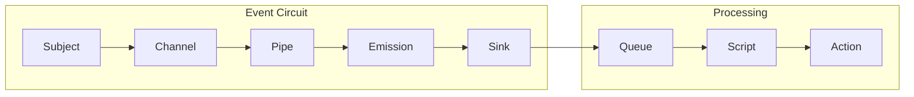

# Synapsed Substrates

Event circuits and observability fabric based on Humainary's Substrates API vision.

## Overview

This crate implements a comprehensive observability framework inspired by Humainary's Substrates, providing event-driven monitoring with proper separation of concerns. It enables fine-grained observation of system behavior through event circuits, percepts, and reactive pipelines.

## Core Concepts

### Event Circuits



### Key Components

- **Subjects**: Observable entities that generate events
- **Channels**: Named event pathways with typed events
- **Pipes**: Processing stages that transform events
- **Emissions**: Actual event instances with payloads
- **Sinks**: Event consumers with filtering and batching
- **Percepts**: Type-safe wrappers with composers
- **Scripts**: Reactive event processing logic
- **Queues**: Priority-based event buffering

## Usage

### Basic Event Circuit

```rust
use synapsed_substrates::{Subject, Channel, Pipe, Sink, Event};

#[tokio::main]
async fn main() -> Result<(), Box<dyn std::error::Error>> {
    // Create a subject (observable entity)
    let subject = Subject::new("user_service");
    
    // Create channels for different event types
    let login_channel = Channel::new("user.login");
    let logout_channel = Channel::new("user.logout");
    
    // Attach channels to subject
    subject.attach_channel(login_channel.clone());
    subject.attach_channel(logout_channel.clone());
    
    // Create processing pipe
    let pipe = Pipe::new()
        .filter(|event| event.severity > Severity::Info)
        .transform(|event| event.with_timestamp());
    
    // Create sink to consume events
    let sink = Sink::new()
        .with_filter(|e| e.metadata.contains_key("user_id"))
        .with_batch_size(10)
        .on_receive(|events| async {
            for event in events {
                println!("Received: {:?}", event);
            }
        });
    
    // Connect the circuit
    login_channel.connect_pipe(pipe.clone());
    pipe.connect_sink(sink);
    
    // Emit events
    subject.emit(&login_channel, Event {
        name: "user.login",
        payload: json!({ "user_id": "123", "ip": "192.168.1.1" }),
        severity: Severity::Info,
        metadata: Default::default(),
    }).await?;
    
    Ok(())
}
```

### Percepts with Type Safety

```rust
use synapsed_substrates::{Percept, Composer, Observable};

// Define a typed percept
#[derive(Percept)]
struct UserLoginPercept {
    user_id: String,
    ip_address: String,
    timestamp: DateTime<Utc>,
}

// Create composer for the percept
let composer = Composer::<UserLoginPercept>::new()
    .with_validator(|p| !p.user_id.is_empty())
    .with_enricher(|p| p.with_geo_location());

// Use in observability
let percept = UserLoginPercept {
    user_id: "123".to_string(),
    ip_address: "192.168.1.1".to_string(),
    timestamp: Utc::now(),
};

composer.compose(percept).emit().await?;
```

### Queue and Script Execution

```rust
use synapsed_substrates::{Queue, Script, Priority};

// Create priority queue
let queue = Queue::new()
    .with_capacity(1000)
    .with_priority_levels(5);

// Define reactive script
let script = Script::new("process_logins")
    .on_event("user.login", |event| async {
        // Process login event
        validate_login(&event).await?;
        update_session(&event).await?;
        audit_log(&event).await?;
    })
    .with_error_handler(|err| async {
        log::error!("Script error: {}", err);
        // Retry or compensate
    });

// Connect queue to script
queue.subscribe(script);

// Enqueue events with priority
queue.enqueue(event, Priority::High).await?;
```

### Subscription Management

```rust
use synapsed_substrates::{Subscription, SubscriptionManager};

let manager = SubscriptionManager::new();

// Create subscription
let subscription = manager.subscribe()
    .to_channel("user.*")  // Wildcard pattern
    .with_filter(|e| e.severity >= Severity::Warning)
    .on_receive(|event| async {
        alert_admin(&event).await;
    })
    .build();

// Manage subscription lifecycle
subscription.pause().await?;
subscription.resume().await?;
subscription.unsubscribe().await?;
```

### Sink Patterns

```rust
use synapsed_substrates::{BasicSink, FilteredSink, BatchingSink};

// Basic sink
let basic_sink = BasicSink::new(|event| async {
    println!("Event: {:?}", event);
});

// Filtered sink
let filtered_sink = FilteredSink::new()
    .with_filter(|e| e.name.starts_with("critical."))
    .with_handler(|event| async {
        send_alert(event).await;
    });

// Batching sink
let batching_sink = BatchingSink::new()
    .with_batch_size(100)
    .with_flush_interval(Duration::from_secs(10))
    .with_handler(|batch| async {
        bulk_process(batch).await;
    });
```

## Integration with Intent System

```rust
use synapsed_substrates::{Subject, Event};
use synapsed_intent::HierarchicalIntent;

// Make intents observable
impl Observable for HierarchicalIntent {
    fn as_subject(&self) -> Subject {
        Subject::new(&format!("intent.{}", self.id))
    }
    
    fn emit_event(&self, event_type: &str) -> Event {
        Event {
            name: format!("intent.{}", event_type),
            payload: self.to_json(),
            severity: Severity::Info,
            metadata: self.metadata.clone(),
        }
    }
}

// Observe intent execution
intent.emit_event("started").await?;
intent.emit_event("step.completed").await?;
intent.emit_event("verified").await?;
```

## Performance Considerations

- **Zero-cost abstractions**: Events are processed with minimal overhead
- **Async-first**: Built on tokio for high concurrency
- **Batching**: Reduces processing overhead for high-volume events
- **Circuit breaking**: Prevents cascade failures
- **Back-pressure**: Automatic flow control in pipelines

## Testing

```bash
cargo test
cargo test --all-features
cargo bench
```

## Features

- `default`: Core observability features
- `metrics`: Prometheus metrics integration
- `tracing`: Distributed tracing support
- `async`: Async event processing (enabled by default)

## License

Licensed under either of:
- Apache License, Version 2.0
- MIT license