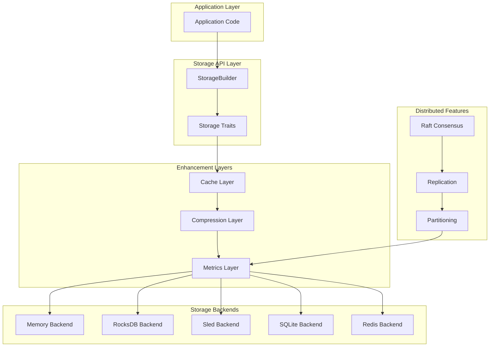
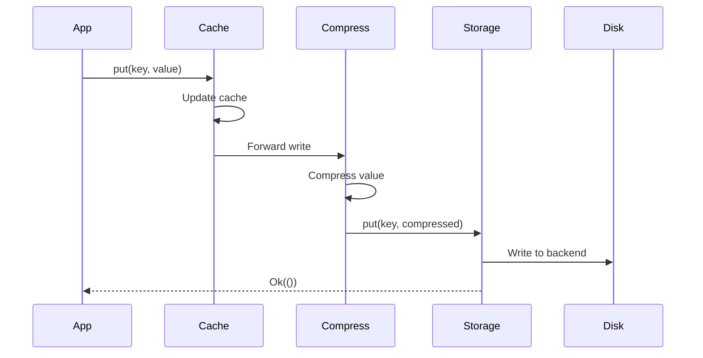
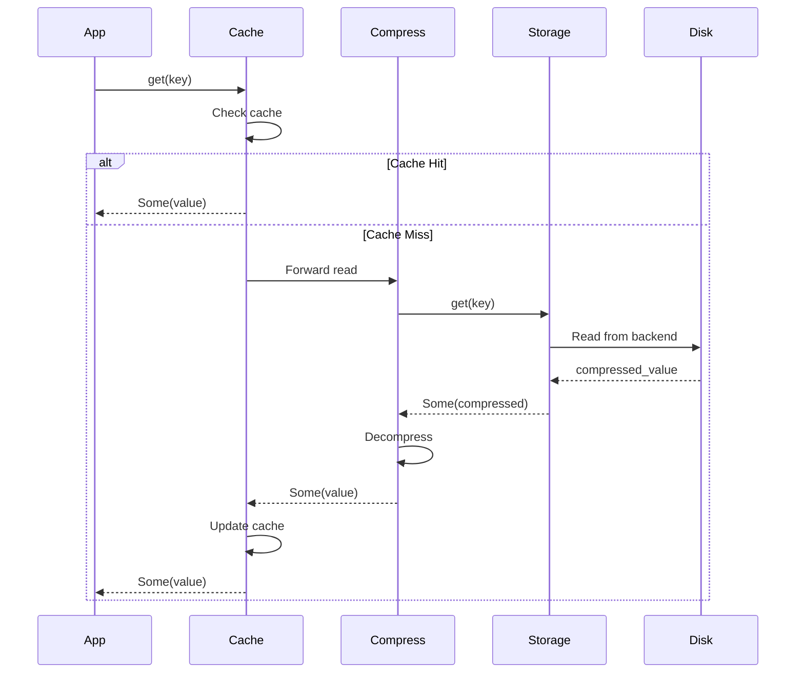

# Synapsed Storage Architecture

## Overview

Synapsed Storage provides a flexible, high-performance storage abstraction layer for the Synapsed ecosystem. It supports multiple storage backends, compression algorithms, caching strategies, and distributed operations through a unified trait-based API.

## Design Principles

1. **Trait-Based Abstraction**: Core functionality defined through composable traits
2. **Plugin Architecture**: Storage backends, caches, and compression as plugins
3. **Layered Design**: Stack multiple capabilities (storage → compression → cache)
4. **Async-First**: Built on Tokio for high-performance async operations
5. **Zero-Copy Operations**: Use `bytes::Bytes` to minimize memory copying
6. **Feature-Gated**: Pay only for what you use through Cargo features

## Component Architecture



## Module Structure

### Core Modules

```
src/
├── lib.rs              # Public API and StorageBuilder
├── traits.rs           # Core trait definitions
├── error.rs            # Error types and handling
└── config.rs           # Configuration structures
```

### Backend Modules

```
src/backends/
├── mod.rs              # Backend trait and common code
├── memory.rs           # In-memory storage (DashMap-based)
├── rocksdb.rs          # RocksDB persistent storage
├── sled.rs             # Sled embedded database
├── sqlite.rs           # SQLite for SQL-compatible storage
└── redis.rs            # Redis for distributed caching
```

### Enhancement Layers

```
src/cache/
├── mod.rs              # Cache trait and layer implementation
├── lru.rs              # LRU eviction policy
├── lfu.rs              # LFU eviction policy
├── arc.rs              # Adaptive Replacement Cache
└── distributed.rs      # Distributed cache coordination

src/compression/
├── mod.rs              # Compression trait and layer
├── lz4.rs              # LZ4 fast compression
├── zstd.rs             # Zstandard high-ratio compression
├── snappy.rs           # Snappy compression
└── adaptive.rs         # Adaptive compression selection
```

### Distributed Features

```
src/distributed/
├── mod.rs              # Distributed storage coordinator
├── partitioner.rs      # Data partitioning strategies
├── replication.rs      # Multi-node replication
├── consensus.rs        # Raft-based consensus
└── discovery.rs        # Node discovery and management
```

## Data Flow

### Write Path



### Read Path



## Trait Hierarchy

### Core Storage Trait

```rust
#[async_trait]
pub trait Storage: Send + Sync {
    type Error: Error + Send + Sync + 'static;
    
    async fn get(&self, key: &[u8]) -> Result<Option<Bytes>, Self::Error>;
    async fn put(&self, key: &[u8], value: &[u8]) -> Result<(), Self::Error>;
    async fn delete(&self, key: &[u8]) -> Result<(), Self::Error>;
    async fn exists(&self, key: &[u8]) -> Result<bool, Self::Error>;
    async fn flush(&self) -> Result<(), Self::Error>;
}
```

### Extended Traits

```rust
// Batch operations for throughput
pub trait BatchedStorage: Storage { ... }

// Iteration support
pub trait IterableStorage: Storage { ... }

// Transaction support
pub trait TransactionalStorage: Storage { ... }

// Snapshot support
pub trait SnapshotStorage: Storage { ... }

// Watch/Subscribe support
pub trait WatchableStorage: Storage { ... }
```

## Error Handling Strategy

### Error Types

```rust
#[derive(Error, Debug)]
pub enum StorageError {
    #[error("Backend error: {0}")]
    Backend(#[from] BackendError),
    
    #[error("Compression error: {0}")]
    Compression(#[from] CompressionError),
    
    #[error("Cache error: {0}")]
    Cache(#[from] CacheError),
    
    #[error("Network error: {0}")]
    Network(#[from] NetworkError),
    
    #[error("Configuration error: {0}")]
    Config(String),
    
    #[error("Operation timeout")]
    Timeout,
    
    #[error("Storage is full")]
    StorageFull,
    
    #[error("Key not found")]
    NotFound,
}
```

### Error Propagation

- Backend-specific errors wrapped in `StorageError::Backend`
- Layer errors preserved with context
- Async errors handled through `Result<T, StorageError>`
- Panic-free error handling throughout

## Configuration System

### Layered Configuration

```yaml
# Example configuration
storage:
  type: rocksdb
  path: /var/lib/synapsed/storage
  options:
    block_cache_size: 67108864  # 64MB
    write_buffer_size: 16777216  # 16MB
    max_open_files: 1000

cache:
  type: lru
  max_entries: 10000
  ttl_seconds: 300

compression:
  enabled: true
  algorithm: lz4
  min_size: 1024  # Only compress values > 1KB

distributed:
  enabled: true
  replication_factor: 3
  consistency_level: quorum
```

### Builder Pattern

```rust
let storage = StorageBuilder::new(config)
    .with_cache(cache_config)
    .with_compression(compression_config)
    .with_metrics(metrics_config)
    .build()
    .await?;
```

## Performance Characteristics

### Backend Comparison

| Backend | Read Latency | Write Latency | Durability | Use Case |
|---------|-------------|---------------|------------|----------|
| Memory | < 1μs | < 1μs | None | Testing, Cache |
| RocksDB | < 100μs | < 500μs | Full | Production |
| Sled | < 50μs | < 200μs | Full | Embedded |
| SQLite | < 200μs | < 1ms | Full | Small datasets |
| Redis | < 1ms | < 1ms | Configurable | Distributed cache |

### Optimization Strategies

1. **Compression Trade-offs**
   - LZ4: Fast but lower ratio (CPU-bound workloads)
   - Zstd: Slower but better ratio (Storage-bound workloads)
   - Adaptive: Choose based on value size and type

2. **Cache Sizing**
   - LRU: Simple, good for recency-based access
   - ARC: Adaptive, better for mixed workloads
   - Distributed: Coordination overhead for consistency

3. **Batch Operations**
   - Group small operations to reduce overhead
   - Use async concurrency for parallel operations
   - Pipeline operations in distributed mode

## Security Considerations

### Encryption

- Optional encryption layer using synapsed-crypto
- Transparent encryption/decryption
- Key management through synapsed-identity

### Access Control

- Integration with synapsed-identity for permissions
- Backend-specific access controls
- Audit logging for compliance

### Data Integrity

- Checksums for corruption detection
- Write-ahead logging for crash recovery
- Periodic integrity checks

## Integration Points

### With Synapsed Ecosystem

1. **synapsed-substrates**: Storage as event source
2. **synapsed-net**: Distributed coordination
3. **synapsed-identity**: Access control and encryption
4. **synapsed-crypto**: Encryption primitives

### External Systems

1. **Prometheus**: Metrics export
2. **OpenTelemetry**: Distributed tracing
3. **Kubernetes**: StatefulSet deployment
4. **S3**: Backup and archival

## Future Enhancements

1. **Additional Backends**
   - FoundationDB for distributed ACID
   - Cassandra for wide-column storage
   - TiKV for distributed transactions

2. **Advanced Features**
   - Multi-version concurrency control (MVCC)
   - Time-series optimizations
   - Geo-distributed replication
   - Column-family support

3. **Performance Improvements**
   - SIMD-accelerated compression
   - io_uring for Linux
   - Hardware acceleration (FPGA/GPU)

## Testing Strategy

### Unit Tests
- Individual backend correctness
- Trait implementation compliance
- Error handling coverage

### Integration Tests
- Multi-layer interaction
- Distributed scenarios
- Failure recovery

### Performance Tests
- Benchmark suite for all backends
- Compression overhead measurement
- Cache hit rate analysis

### Chaos Testing
- Network partition handling
- Node failure recovery
- Data corruption detection