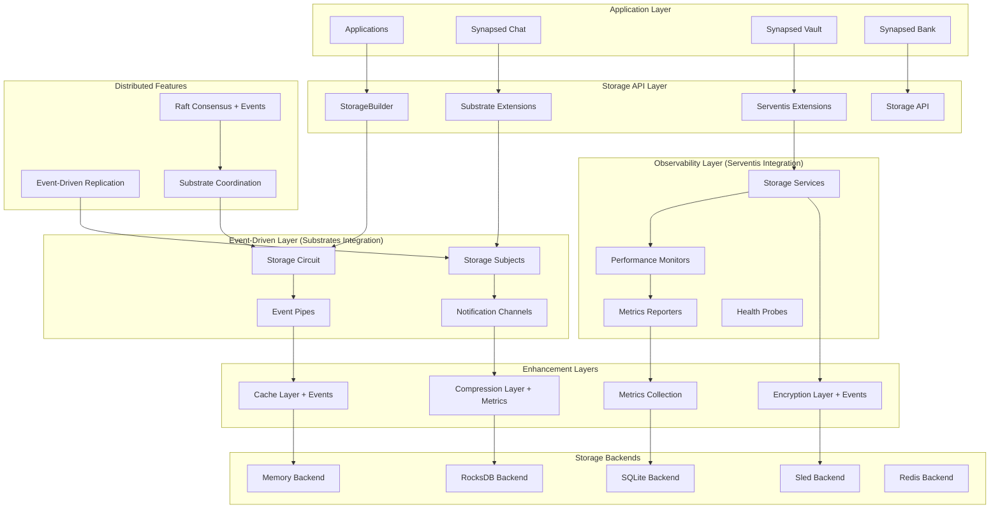

# SPARC Architecture: synapsed-storage with Substrate and Serventis Integration

## Architecture Phase Overview

This document defines the comprehensive system architecture for synapsed-storage with deep integration into the Synapsed ecosystem through synapsed-substrates (event-driven framework) and synapsed-serventis (observability framework).

## 1. High-Level System Architecture



## 2. Component Architecture

### 2.1 Core Storage with Substrate Integration

```rust
// Enhanced storage trait with substrate event integration
#[async_trait]
pub trait SubstrateStorage: Storage + Substrate {
    /// Storage subject for event emission
    fn subject(&self) -> &Subject;
    
    /// Emit storage event through substrate circuit
    async fn emit_storage_event(&self, event: StorageEvent) -> SubstratesResult<()>;
    
    /// Subscribe to storage events
    async fn subscribe_events(&self) -> SubstratesResult<StorageEventSubscription>;
}

// Storage events emitted through substrate system
#[derive(Debug, Clone)]
pub enum StorageEvent {
    KeyCreated { key: Bytes, size: usize },
    KeyUpdated { key: Bytes, old_size: usize, new_size: usize },
    KeyDeleted { key: Bytes, size: usize },
    CacheHit { key: Bytes },
    CacheMiss { key: Bytes },
    CompressionApplied { key: Bytes, ratio: f64 },
    BackendConnected { backend_type: String },
    BackendDisconnected { backend_type: String },
    TransactionStarted { tx_id: Uuid },
    TransactionCommitted { tx_id: Uuid },
    TransactionRolledBack { tx_id: Uuid },
}
```

### 2.2 Serventis Service Integration

```rust
// Storage operations as serventis services
#[async_trait]
pub trait StorageService: Service + Storage {
    /// Service call for storage get operation
    async fn service_get(&mut self, key: &[u8]) -> SubstratesResult<Option<Bytes>> {
        self.called().await?; // Serventis signal
        
        match self.get(key).await {
            Ok(value) => {
                self.succeed().await?; // Custom success signal
                Ok(value)
            }
            Err(e) => {
                self.failed().await?; // Serventis failure signal
                Err(e.into())
            }
        }
    }
    
    /// Service call for storage put operation
    async fn service_put(&mut self, key: &[u8], value: &[u8]) -> SubstratesResult<()>;
    
    /// Service call for storage delete operation
    async fn service_delete(&mut self, key: &[u8]) -> SubstratesResult<()>;
}

// Custom serventis signals for storage operations
#[derive(Debug, Clone, Serialize, Deserialize)]
pub enum StorageSignal {
    // Standard serventis signals
    Call, Called, Delay, Delayed,
    Discard, Discarded, Disconnect, Disconnected,
    Expire, Expired, Fail, Failed,
    
    // Storage-specific signals
    Succeed, Succeeded,        // Successful operation
    Compress, Compressed,      // Compression applied
    Cache, Cached,            // Cache operation
    Replicate, Replicated,    // Replication operation
    Encrypt, Encrypted,       // Encryption applied
}
```

### 2.3 Event-Driven Storage Circuit

```rust
// Storage circuit implementation using substrates
pub struct StorageCircuit {
    circuit: Arc<dyn Circuit>,
    storage_subject: Subject,
    event_channels: HashMap<String, Arc<dyn Channel<StorageEvent>>>,
    service_monitors: HashMap<String, Arc<dyn Monitor>>,
}

impl StorageCircuit {
    pub fn new() -> SubstratesResult<Self> {
        let circuit = BasicCircuit::new();
        let storage_subject = Subject::new(
            Name::from("storage"),
            SubjectType::Service
        );
        
        Ok(Self {
            circuit: Arc::new(circuit),
            storage_subject,
            event_channels: HashMap::new(),
            service_monitors: HashMap::new(),
        })
    }
    
    /// Register storage backend with circuit
    pub async fn register_backend<B>(&mut self, backend: B) -> SubstratesResult<()>
    where
        B: SubstrateStorage + 'static
    {
        // Create subject for this backend
        let backend_subject = Subject::with_parent(
            Name::from(backend.name()),
            SubjectType::Resource,
            self.storage_subject.clone()
        );
        
        // Create event channel
        let channel = self.circuit.create_channel(backend_subject)?;
        self.event_channels.insert(backend.name().to_string(), channel);
        
        // Create service monitor
        let monitor = BasicMonitor::new(backend_subject.clone());
        self.service_monitors.insert(backend.name().to_string(), Arc::new(monitor));
        
        Ok(())
    }
    
    /// Process storage event through circuit
    pub async fn process_event(&self, event: StorageEvent) -> SubstratesResult<()> {
        // Emit through substrate circuit
        for channel in self.event_channels.values() {
            channel.emit(event.clone()).await?;
        }
        
        // Update service monitors
        self.update_monitors(&event).await?;
        
        Ok(())
    }
    
    async fn update_monitors(&self, event: &StorageEvent) -> SubstratesResult<()> {
        match event {
            StorageEvent::KeyCreated { .. } => {
                for monitor in self.service_monitors.values() {
                    monitor.operational().await?;
                }
            }
            StorageEvent::BackendDisconnected { backend_type } => {
                if let Some(monitor) = self.service_monitors.get(backend_type) {
                    monitor.degraded().await?;
                }
            }
            _ => {}
        }
        Ok(())
    }
}
```

## 3. Data Storage Strategies with Substrate Event Sourcing

### 3.1 Event-Sourced Storage Backend

```rust
// Event-sourced storage implementation
pub struct EventSourcedStorage<B: Storage> {
    backend: B,
    event_store: Arc<dyn Storage>,
    circuit: Arc<StorageCircuit>,
    subject: Subject,
}

impl<B: Storage> EventSourcedStorage<B> {
    pub fn new(backend: B, event_store: Arc<dyn Storage>) -> SubstratesResult<Self> {
        let circuit = Arc::new(StorageCircuit::new()?);
        let subject = Subject::new(
            Name::from("event-sourced-storage"),
            SubjectType::Service
        );
        
        Ok(Self {
            backend,
            event_store,
            circuit,
            subject,
        })
    }
    
    async fn store_event(&self, event: StorageEvent) -> Result<(), StorageError> {
        let event_key = format!("event:{}:{}", 
            chrono::Utc::now().timestamp_nanos(),
            uuid::Uuid::new_v4()
        );
        
        let event_data = bincode::serialize(&event)
            .map_err(|e| StorageError::Serialization(e.to_string()))?;
        
        self.event_store.put(event_key.as_bytes(), &event_data).await?;
        self.circuit.process_event(event).await?;
        
        Ok(())
    }
}

#[async_trait]
impl<B: Storage> Storage for EventSourcedStorage<B> {
    type Error = StorageError;
    
    async fn get(&self, key: &[u8]) -> Result<Option<Bytes>, Self::Error> {
        let result = self.backend.get(key).await?;
        
        // Emit event
        let event = if result.is_some() {
            StorageEvent::CacheHit { key: Bytes::copy_from_slice(key) }
        } else {
            StorageEvent::CacheMiss { key: Bytes::copy_from_slice(key) }
        };
        
        self.store_event(event).await?;
        Ok(result)
    }
    
    async fn put(&self, key: &[u8], value: &[u8]) -> Result<(), Self::Error> {
        let old_size = self.backend.get(key).await?
            .map(|v| v.len())
            .unwrap_or(0);
        
        self.backend.put(key, value).await?;
        
        let event = if old_size == 0 {
            StorageEvent::KeyCreated { 
                key: Bytes::copy_from_slice(key), 
                size: value.len() 
            }
        } else {
            StorageEvent::KeyUpdated { 
                key: Bytes::copy_from_slice(key),
                old_size,
                new_size: value.len()
            }
        };
        
        self.store_event(event).await?;
        Ok(())
    }
    
    async fn delete(&self, key: &[u8]) -> Result<(), Self::Error> {
        let old_value = self.backend.get(key).await?;
        self.backend.delete(key).await?;
        
        if let Some(value) = old_value {
            let event = StorageEvent::KeyDeleted {
                key: Bytes::copy_from_slice(key),
                size: value.len()
            };
            self.store_event(event).await?;
        }
        
        Ok(())
    }
}
```

### 3.2 Substrate-Integrated Cache Layer

```rust
// Cache layer with substrate event integration
pub struct SubstrateCacheLayer<S: Storage> {
    storage: S,
    cache: Arc<dyn Cache>,
    circuit: Arc<StorageCircuit>,
    cache_subject: Subject,
}

impl<S: Storage> SubstrateCacheLayer<S> {
    pub fn new(storage: S, cache: Arc<dyn Cache>) -> SubstratesResult<Self> {
        let circuit = Arc::new(StorageCircuit::new()?);
        let cache_subject = Subject::new(
            Name::from("cache-layer"),
            SubjectType::Cache
        );
        
        Ok(Self {
            storage,
            cache,
            circuit,
            cache_subject,
        })
    }
    
    async fn emit_cache_event(&self, event: StorageEvent) -> SubstratesResult<()> {
        self.circuit.process_event(event).await
    }
}

#[async_trait]
impl<S: Storage> Storage for SubstrateCacheLayer<S> {
    type Error = StorageError;
    
    async fn get(&self, key: &[u8]) -> Result<Option<Bytes>, Self::Error> {
        // Check cache first
        if let Some(cached) = self.cache.get(key).await? {
            self.emit_cache_event(StorageEvent::CacheHit { 
                key: Bytes::copy_from_slice(key) 
            }).await?;
            return Ok(Some(cached));
        }
        
        // Cache miss - get from storage
        let value = self.storage.get(key).await?;
        
        if let Some(ref v) = value {
            // Store in cache
            self.cache.put(key, v.clone()).await?;
        }
        
        self.emit_cache_event(StorageEvent::CacheMiss { 
            key: Bytes::copy_from_slice(key) 
        }).await?;
        
        Ok(value)
    }
    
    async fn put(&self, key: &[u8], value: &[u8]) -> Result<(), Self::Error> {
        // Update storage
        self.storage.put(key, value).await?;
        
        // Update cache
        self.cache.put(key, Bytes::copy_from_slice(value)).await?;
        
        // Emit cache update event
        self.emit_cache_event(StorageEvent::KeyUpdated {
            key: Bytes::copy_from_slice(key),
            old_size: 0, // Would need to track this
            new_size: value.len()
        }).await?;
        
        Ok(())
    }
}
```

## 4. Serventis Integration Points

### 4.1 Storage Service Monitors

```rust
// Storage-specific monitors using serventis
pub struct StorageMonitor {
    monitor: Arc<dyn Monitor>,
    subject: Subject,
    metrics: Arc<Mutex<StorageMetrics>>,
}

impl StorageMonitor {
    pub fn new() -> SubstratesResult<Self> {
        let subject = Subject::new(
            Name::from("storage-monitor"),
            SubjectType::Monitor
        );
        
        let monitor = BasicMonitor::new(subject.clone());
        
        Ok(Self {
            monitor: Arc::new(monitor),
            subject,
            metrics: Arc::new(Mutex::new(StorageMetrics::default())),
        })
    }
    
    pub async fn record_operation(&self, operation: &str, duration: Duration, success: bool) -> SubstratesResult<()> {
        {
            let mut metrics = self.metrics.lock().await;
            metrics.record_operation(operation, duration, success);
        }
        
        if success {
            self.monitor.operational().await?;
        } else {
            self.monitor.degraded().await?;
        }
        
        Ok(())
    }
    
    pub async fn get_health_status(&self) -> SubstratesResult<HealthStatus> {
        let metrics = self.metrics.lock().await;
        let error_rate = metrics.error_rate();
        let avg_latency = metrics.average_latency();
        
        if error_rate > 0.1 || avg_latency > Duration::from_millis(1000) {
            self.monitor.degraded().await?;
            Ok(HealthStatus::Degraded)
        } else if error_rate > 0.05 || avg_latency > Duration::from_millis(500) {
            self.monitor.concerning().await?;
            Ok(HealthStatus::Concerning)
        } else {
            self.monitor.operational().await?;
            Ok(HealthStatus::Operational)
        }
    }
}

#[derive(Debug, Clone)]
pub enum HealthStatus {
    Operational,
    Concerning,
    Degraded,
    Failed,
}

#[derive(Debug, Default)]
struct StorageMetrics {
    operations: HashMap<String, OperationMetrics>,
    total_operations: u64,
    total_errors: u64,
}

#[derive(Debug, Default)]
struct OperationMetrics {
    count: u64,
    errors: u64,
    total_duration: Duration,
    min_duration: Option<Duration>,
    max_duration: Option<Duration>,
}
```

### 4.2 Storage Reporters

```rust
// Storage metrics reporter using serventis
pub struct StorageReporter {
    reporter: Arc<dyn Reporter>,
    subject: Subject,
    storage_monitor: Arc<StorageMonitor>,
}

impl StorageReporter {
    pub fn new(storage_monitor: Arc<StorageMonitor>) -> SubstratesResult<Self> {
        let subject = Subject::new(
            Name::from("storage-reporter"),
            SubjectType::Reporter
        );
        
        let reporter = BasicReporter::new(subject.clone());
        
        Ok(Self {
            reporter: Arc::new(reporter),
            subject,
            storage_monitor,
        })
    }
    
    pub async fn generate_report(&self) -> SubstratesResult<StorageReport> {
        let health_status = self.storage_monitor.get_health_status().await?;
        let metrics = self.storage_monitor.get_metrics().await;
        
        let report = StorageReport {
            timestamp: chrono::Utc::now(),
            health_status,
            metrics,
            recommendations: self.generate_recommendations(&health_status, &metrics),
        };
        
        // Emit report through serventis
        self.reporter.report(format!("{:?}", report)).await?;
        
        Ok(report)
    }
    
    fn generate_recommendations(&self, status: &HealthStatus, metrics: &StorageMetrics) -> Vec<String> {
        let mut recommendations = Vec::new();
        
        match status {
            HealthStatus::Degraded => {
                recommendations.push("Consider increasing cache size".to_string());
                recommendations.push("Check backend connection health".to_string());
            }
            HealthStatus::Concerning => {
                recommendations.push("Monitor storage performance closely".to_string());
            }
            _ => {}
        }
        
        if metrics.get_operation_error_rate("get") > 0.05 {
            recommendations.push("Investigate read operation failures".to_string());
        }
        
        recommendations
    }
}

#[derive(Debug, Clone)]
pub struct StorageReport {
    pub timestamp: chrono::DateTime<chrono::Utc>,
    pub health_status: HealthStatus,
    pub metrics: StorageMetrics,
    pub recommendations: Vec<String>,
}
```

## 5. Module Organization and Dependencies

### 5.1 Enhanced Module Structure

```
synapsed-storage/
├── src/
│   ├── lib.rs                 # Main library with substrate/serventis integration
│   ├── traits.rs              # Core storage traits
│   ├── error.rs               # Error types
│   ├── config.rs              # Configuration
│   │
│   ├── substrates/            # Substrate integration
│   │   ├── mod.rs             # Substrate storage extensions
│   │   ├── circuit.rs         # Storage circuit implementation
│   │   ├── events.rs          # Storage event definitions
│   │   ├── subjects.rs        # Storage subject implementations
│   │   └── integration.rs     # Substrate integration layer
│   │
│   ├── serventis/             # Serventis integration
│   │   ├── mod.rs             # Serventis storage extensions
│   │   ├── services.rs        # Storage service implementations
│   │   ├── monitors.rs        # Storage monitoring
│   │   ├── reporters.rs       # Storage reporting
│   │   ├── probes.rs          # Storage health probes
│   │   └── integration.rs     # Serventis integration layer
│   │
│   ├── backends/              # Storage backends
│   │   ├── mod.rs             # Backend trait and common code
│   │   ├── memory.rs          # Memory backend with events
│   │   ├── rocksdb.rs         # RocksDB backend with monitoring
│   │   ├── sled.rs            # Sled backend with events
│   │   ├── sqlite.rs          # SQLite backend with monitoring
│   │   └── redis.rs           # Redis backend with events
│   │
│   ├── layers/                # Enhancement layers
│   │   ├── mod.rs             # Layer trait definitions
│   │   ├── cache.rs           # Cache layer with substrate events
│   │   ├── compression.rs     # Compression layer with metrics
│   │   ├── encryption.rs      # Encryption layer with events
│   │   └── metrics.rs         # Metrics collection layer
│   │
│   ├── distributed/           # Distributed features
│   │   ├── mod.rs             # Distributed coordination
│   │   ├── consensus.rs       # Raft consensus with events
│   │   ├── replication.rs     # Event-driven replication
│   │   └── coordination.rs    # Substrate-based coordination
│   │
│   └── integration/           # Integration utilities
│       ├── mod.rs             # Integration helpers
│       ├── builder.rs         # Enhanced storage builder
│       └── prelude.rs         # Convenient imports
│
├── examples/                  # Integration examples
│   ├── substrate_storage.rs   # Substrate integration example
│   ├── serventis_monitoring.rs # Serventis monitoring example
│   └── full_integration.rs    # Complete integration example
│
└── tests/
    ├── integration/
    │   ├── substrate_tests.rs  # Substrate integration tests
    │   └── serventis_tests.rs  # Serventis integration tests
    └── end_to_end.rs          # Full system tests
```

### 5.2 Dependency Architecture

```toml
[dependencies]
# Core dependencies
tokio = { workspace = true }
async-trait = { workspace = true }
bytes = "1.4"
serde = { workspace = true }
thiserror = { workspace = true }
tracing = { workspace = true }
uuid = { workspace = true }
chrono = { workspace = true }

# Synapsed ecosystem integration
synapsed-substrates = { path = "../synapsed-substrates" }
synapsed-serventis = { path = "../synapsed-serventis" }
synapsed-crypto = { path = "../synapsed-crypto", optional = true }

# Storage backends (feature-gated)
sled = { workspace = true, optional = true }
rocksdb = { workspace = true, optional = true }
redis = { version = "0.24", optional = true }
rusqlite = { version = "0.30", features = ["bundled"], optional = true }

# Compression (feature-gated)
lz4 = { version = "1.24", optional = true }
zstd = { version = "0.13", optional = true }
snap = { version = "1.1", optional = true }

# Distributed features (feature-gated)
raft = { version = "0.7", optional = true }
libp2p = { workspace = true, optional = true }

[features]
default = ["memory", "cache"]
memory = []
rocksdb = ["dep:rocksdb"]
sled = ["dep:sled"]
sqlite = ["dep:rusqlite"]
redis = ["dep:redis"]
compression = ["lz4", "zstd", "snap"]
lz4 = ["dep:lz4"]
zstd = ["dep:zstd"]
snap = ["dep:snap"]
distributed = ["raft", "libp2p"]
raft = ["dep:raft"]
libp2p = ["dep:libp2p"]
encryption = ["synapsed-crypto"]
cache = []
metrics = []
substrate-integration = ["synapsed-substrates"]
serventis-integration = ["synapsed-serventis"]
full-integration = ["substrate-integration", "serventis-integration", "encryption", "distributed", "metrics"]
```

## 6. Integration API Design

### 6.1 Unified Storage Builder with Integration

```rust
// Enhanced storage builder with substrate/serventis integration
pub struct IntegratedStorageBuilder {
    config: StorageConfig,
    substrate_config: Option<SubstrateConfig>,
    serventis_config: Option<ServentisConfig>,
    cache_config: Option<CacheConfig>,
    compression_config: Option<CompressionConfig>,
    encryption_config: Option<EncryptionConfig>,
    distributed_config: Option<DistributedConfig>,
}

impl IntegratedStorageBuilder {
    pub fn new(config: StorageConfig) -> Self {
        Self {
            config,
            substrate_config: None,
            serventis_config: None,
            cache_config: None,
            compression_config: None,
            encryption_config: None,
            distributed_config: None,
        }
    }
    
    /// Enable substrate integration for event-driven storage
    pub fn with_substrates(mut self, config: SubstrateConfig) -> Self {
        self.substrate_config = Some(config);
        self
    }
    
    /// Enable serventis integration for observability
    pub fn with_serventis(mut self, config: ServentisConfig) -> Self {
        self.serventis_config = Some(config);
        self
    }
    
    /// Enable full ecosystem integration
    pub fn with_full_integration(self) -> Self {
        self.with_substrates(SubstrateConfig::default())
            .with_serventis(ServentisConfig::default())
    }
    
    /// Build integrated storage instance
    pub async fn build(self) -> Result<IntegratedStorage, StorageError> {
        let mut storage = self.build_base_storage().await?;
        
        // Apply enhancement layers
        if let Some(encryption_config) = self.encryption_config {
            storage = Box::new(EncryptionLayer::new(storage, encryption_config)?);
        }
        
        if let Some(compression_config) = self.compression_config {
            storage = Box::new(CompressionLayer::new(storage, compression_config)?);
        }
        
        if let Some(cache_config) = self.cache_config {
            storage = Box::new(SubstrateCacheLayer::new(storage, cache_config)?);
        }
        
        // Apply integration layers
        let mut integrated = IntegratedStorage::new(storage);
        
        if let Some(substrate_config) = self.substrate_config {
            integrated = integrated.with_substrate_integration(substrate_config).await?;
        }
        
        if let Some(serventis_config) = self.serventis_config {
            integrated = integrated.with_serventis_integration(serventis_config).await?;
        }
        
        Ok(integrated)
    }
}

// Fully integrated storage with all ecosystem features
pub struct IntegratedStorage {
    storage: Box<dyn Storage<Error = StorageError>>,
    circuit: Option<Arc<StorageCircuit>>,
    monitor: Option<Arc<StorageMonitor>>,
    reporter: Option<Arc<StorageReporter>>,
    subject: Subject,
}

impl IntegratedStorage {
    /// Create new integrated storage instance
    pub fn new(storage: Box<dyn Storage<Error = StorageError>>) -> Self {
        let subject = Subject::new(
            Name::from("integrated-storage"),
            SubjectType::Service
        );
        
        Self {
            storage,
            circuit: None,
            monitor: None,
            reporter: None,
            subject,
        }
    }
    
    /// Add substrate integration
    pub async fn with_substrate_integration(mut self, config: SubstrateConfig) -> Result<Self, StorageError> {
        let circuit = Arc::new(StorageCircuit::new()?);
        
        // Register this storage with the circuit
        circuit.register_integrated_storage(&self).await?;
        
        self.circuit = Some(circuit);
        Ok(self)
    }
    
    /// Add serventis integration
    pub async fn with_serventis_integration(mut self, config: ServentisConfig) -> Result<Self, StorageError> {
        let monitor = Arc::new(StorageMonitor::new()?);
        let reporter = Arc::new(StorageReporter::new(monitor.clone())?);
        
        self.monitor = Some(monitor);
        self.reporter = Some(reporter);
        Ok(self)
    }
    
    /// Get substrate circuit if available
    pub fn circuit(&self) -> Option<&Arc<StorageCircuit>> {
        self.circuit.as_ref()
    }
    
    /// Get serventis monitor if available
    pub fn monitor(&self) -> Option<&Arc<StorageMonitor>> {
        self.monitor.as_ref()
    }
    
    /// Get serventis reporter if available
    pub fn reporter(&self) -> Option<&Arc<StorageReporter>> {
        self.reporter.as_ref()
    }
    
    /// Subscribe to storage events (if substrate integration enabled)
    pub async fn subscribe_events(&self) -> Result<StorageEventSubscription, StorageError> {
        if let Some(circuit) = &self.circuit {
            Ok(circuit.subscribe_all_events().await?)
        } else {
            Err(StorageError::Config("Substrate integration not enabled".to_string()))
        }
    }
    
    /// Get current health status (if serventis integration enabled)
    pub async fn health_status(&self) -> Result<HealthStatus, StorageError> {
        if let Some(monitor) = &self.monitor {
            Ok(monitor.get_health_status().await?)
        } else {
            Err(StorageError::Config("Serventis integration not enabled".to_string()))
        }
    }
    
    /// Generate performance report (if serventis integration enabled)
    pub async fn generate_report(&self) -> Result<StorageReport, StorageError> {
        if let Some(reporter) = &self.reporter {
            Ok(reporter.generate_report().await?)
        } else {
            Err(StorageError::Config("Serventis integration not enabled".to_string()))
        }
    }
}

#[async_trait]
impl Storage for IntegratedStorage {
    type Error = StorageError;
    
    async fn get(&self, key: &[u8]) -> Result<Option<Bytes>, Self::Error> {
        let start = std::time::Instant::now();
        let result = self.storage.get(key).await;
        let duration = start.elapsed();
        
        // Record metrics if serventis integration enabled
        if let Some(monitor) = &self.monitor {
            monitor.record_operation("get", duration, result.is_ok()).await?;
        }
        
        // Emit event if substrate integration enabled
        if let Some(circuit) = &self.circuit {
            let event = match &result {
                Ok(Some(_)) => StorageEvent::CacheHit { key: Bytes::copy_from_slice(key) },
                Ok(None) => StorageEvent::CacheMiss { key: Bytes::copy_from_slice(key) },
                Err(_) => StorageEvent::OperationFailed { 
                    operation: "get".to_string(),
                    key: Bytes::copy_from_slice(key)
                },
            };
            circuit.process_event(event).await?;
        }
        
        result
    }
    
    async fn put(&self, key: &[u8], value: &[u8]) -> Result<(), Self::Error> {
        let start = std::time::Instant::now();
        let result = self.storage.put(key, value).await;
        let duration = start.elapsed();
        
        // Record metrics
        if let Some(monitor) = &self.monitor {
            monitor.record_operation("put", duration, result.is_ok()).await?;
        }
        
        // Emit event
        if let Some(circuit) = &self.circuit {
            let event = if result.is_ok() {
                StorageEvent::KeyUpdated {
                    key: Bytes::copy_from_slice(key),
                    old_size: 0, // Would need to track
                    new_size: value.len()
                }
            } else {
                StorageEvent::OperationFailed {
                    operation: "put".to_string(),
                    key: Bytes::copy_from_slice(key)
                }
            };
            circuit.process_event(event).await?;
        }
        
        result
    }
    
    async fn delete(&self, key: &[u8]) -> Result<(), Self::Error> {
        let start = std::time::Instant::now();
        let result = self.storage.delete(key).await;
        let duration = start.elapsed();
        
        // Record metrics
        if let Some(monitor) = &self.monitor {
            monitor.record_operation("delete", duration, result.is_ok()).await?;
        }
        
        // Emit event
        if let Some(circuit) = &self.circuit {
            let event = if result.is_ok() {
                StorageEvent::KeyDeleted {
                    key: Bytes::copy_from_slice(key),
                    size: 0 // Would need to track
                }
            } else {
                StorageEvent::OperationFailed {
                    operation: "delete".to_string(),
                    key: Bytes::copy_from_slice(key)
                }
            };
            circuit.process_event(event).await?;
        }
        
        result
    }
}
```

## 7. Performance and Scalability Considerations

### 7.1 Event Processing Optimization

- **Async Event Processing**: All substrate events processed asynchronously
- **Event Batching**: Group related events to reduce circuit overhead
- **Selective Monitoring**: Only monitor critical operations by default
- **Circuit Optimization**: Use efficient substrate circuits for high-throughput scenarios

### 7.2 Integration Overhead Management

- **Feature Gates**: All integrations are optional and feature-gated
- **Lazy Initialization**: Substrate/serventis components initialized only when needed
- **Efficient Serialization**: Use bincode for internal event serialization
- **Connection Pooling**: Reuse substrate/serventis connections

## 8. Usage Examples

### 8.1 Basic Integration

```rust
use synapsed_storage::prelude::*;
use synapsed_storage::integration::IntegratedStorageBuilder;

#[tokio::main]
async fn main() -> Result<(), Box<dyn std::error::Error>> {
    // Create integrated storage with full ecosystem support
    let storage = IntegratedStorageBuilder::new(StorageConfig::Memory(Default::default()))
        .with_full_integration()
        .with_cache(CacheConfig::lru(1000))
        .build()
        .await?;
    
    // Subscribe to storage events
    let mut events = storage.subscribe_events().await?;
    
    // Perform storage operations
    storage.put(b"key1", b"value1").await?;
    let value = storage.get(b"key1").await?;
    
    // Check health status
    let health = storage.health_status().await?;
    println!("Storage health: {:?}", health);
    
    // Generate performance report
    let report = storage.generate_report().await?;
    println!("Performance report: {:?}", report);
    
    Ok(())
}
```

### 8.2 Event-Driven Application

```rust
use synapsed_storage::substrates::{StorageEvent, StorageEventSubscription};

async fn handle_storage_events(mut subscription: StorageEventSubscription) {
    while let Some(event) = subscription.next().await {
        match event {
            StorageEvent::KeyCreated { key, size } => {
                println!("New key created: {:?}, size: {}", key, size);
            }
            StorageEvent::CacheMiss { key } => {
                println!("Cache miss for key: {:?}", key);
                // Could trigger pre-loading or cache warming
            }
            StorageEvent::BackendDisconnected { backend_type } => {
                println!("Backend disconnected: {}", backend_type);
                // Could trigger failover logic
            }
            _ => {}
        }
    }
}
```

## 9. Testing Strategy

### 9.1 Integration Testing

- **Substrate Circuit Testing**: Verify event emission and processing
- **Serventis Monitor Testing**: Validate metrics collection and health reporting  
- **End-to-End Integration**: Full ecosystem integration tests
- **Performance Regression**: Ensure integration doesn't impact storage performance

### 9.2 Compatibility Testing

- **Substrate API Compatibility**: Ensure substrate integration follows API contracts
- **Serventis Signal Compatibility**: Verify serventis signals are properly emitted
- **Cross-Component Integration**: Test with other synapsed components

## 10. Migration and Deployment

### 10.1 Gradual Integration Path

1. **Phase 1**: Basic substrate event integration
2. **Phase 2**: Serventis monitoring integration  
3. **Phase 3**: Advanced features (distributed coordination, full observability)
4. **Phase 4**: Performance optimization and production deployment

### 10.2 Backward Compatibility

- All integrations are opt-in through feature flags
- Existing storage API remains unchanged
- Legacy applications can upgrade incrementally

## Conclusion

This architecture provides deep integration between synapsed-storage and the broader Synapsed ecosystem through substrate event-driven patterns and serventis observability. The design maintains modularity and performance while enabling rich event-driven and monitoring capabilities that enhance the overall system architecture.

The integration is designed to be:
- **Optional**: All integrations are feature-gated
- **Performant**: Minimal overhead when integrations are disabled
- **Extensible**: Easy to add new substrate subjects and serventis services
- **Compatible**: Works with existing storage implementations
- **Observable**: Rich monitoring and event capabilities for production systems