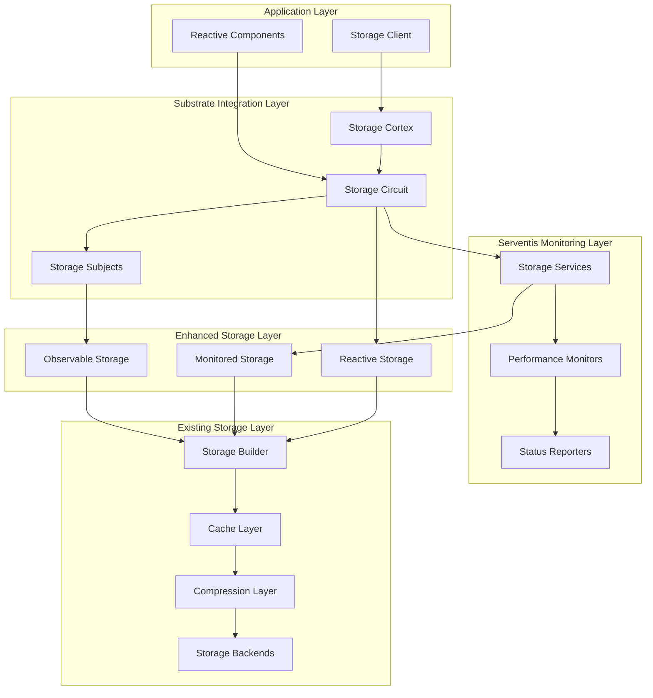
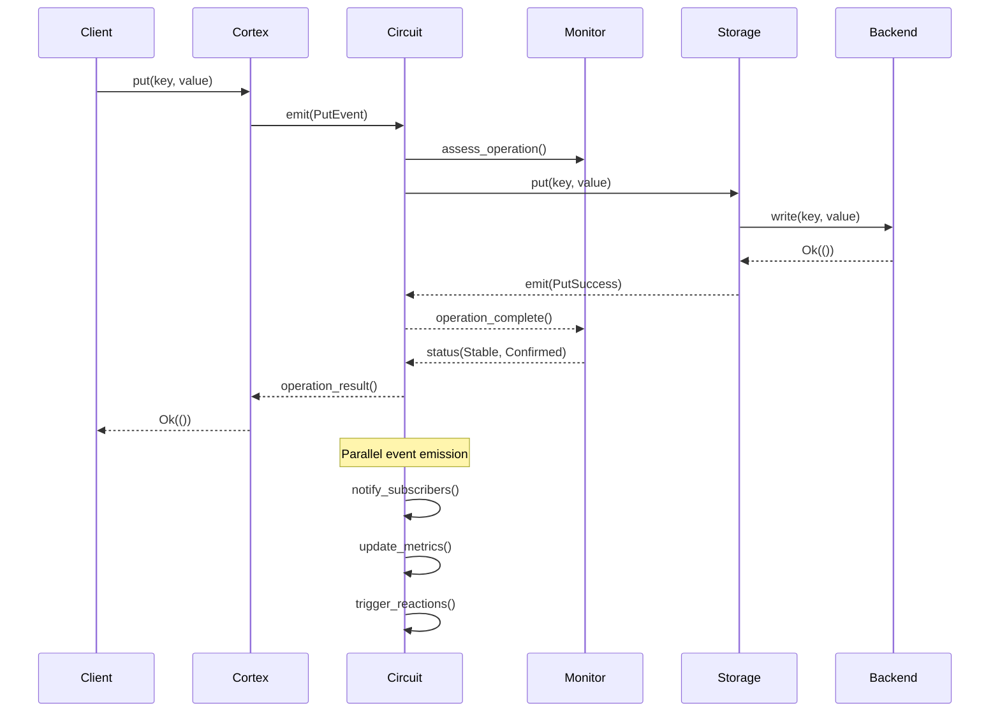

# SPARC Specification: Substrate and Serventis Integration for synapsed-storage

## 1. Specification Phase - Comprehensive Requirements

### 1.1 Executive Summary

This specification defines the integration of synapsed-storage with the substrates and serventis frameworks to create an event-driven, observable storage layer that supports real-time monitoring, circuit-based data flow, and semiotic observability patterns.

**Core Integration Goals:**
- Transform storage operations into substrate events using Circuit/Subject abstractions
- Add comprehensive observability through serventis Monitors and Services
- Maintain backward compatibility with existing storage traits
- Enable reactive programming patterns for storage operations
- Provide distributed system observability and coordination

### 1.2 Current Architecture Analysis

#### 1.2.1 Existing synapsed-storage Components

**Core Traits:**
- `Storage`: Basic key-value operations (get, put, delete, exists, flush)
- `BatchedStorage`: Batch operations for improved throughput
- `IterableStorage`: Range queries and prefix iteration
- `TransactionalStorage`: ACID transaction support
- `SnapshotStorage`: Consistent backup operations
- `WatchableStorage`: Change notifications

**Backend Implementations:**
- `MemoryStorage`: In-memory HashMap-based storage
- `RocksDbStorage`: Persistent RocksDB backend
- `SledStorage`: Embedded database backend
- `SqliteStorage`: SQL-compatible storage
- `RedisStorage`: Distributed cache storage

**Enhancement Layers:**
- `CacheLayer`: LRU/LFU caching with configurable policies
- `CompressionLayer`: LZ4/Zstd/Snappy compression
- `MetricsLayer`: Prometheus metrics collection

#### 1.2.2 Substrates Framework Components

**Core Abstractions:**
- `Subject`: Hierarchical reference system with identity and state
- `Circuit`: Computational network managing data flow
- `Conduit`: Routes emitted values between channels and pipes
- `Channel`: Subject-based input ports to conduits
- `Pipe`: Abstraction for passing typed values through pipelines
- `Cortex`: Bootstrap entry point into substrates runtime

**Key Types:**
- `Name`: Hierarchical naming system (dot-separated)
- `State`: Collection of typed named slots
- `Id`: UUID-based unique identifiers
- `SubjectType`: Classification system for different subject types

#### 1.2.3 Serventis Framework Components

**Observability APIs:**
- `Services`: Monitor service-to-service interactions with signals
- `Monitors`: Assess operational condition with confidence levels
- `Reporters`: Generate situational assessments
- `Probes`: Monitor communication outcomes
- `Resources`: Track interactions with shared resources
- `Queues`: Monitor queue-like system interactions

**Core Types:**
- `Signal`: Service interaction events (call, fail, expire, etc.)
- `Condition`: Operational state (stable, degraded, down, etc.)
- `Confidence`: Statistical certainty (tentative, measured, confirmed)
- `Status`: Combination of condition and confidence

### 1.3 Integration Requirements

#### 1.3.1 Functional Requirements

**FR-1: Storage as Substrate Events**
- All storage operations MUST emit events through substrate circuits
- Storage backends MUST be wrapped as substrate components
- Operations MUST flow through configurable pipe networks
- State changes MUST be observable through substrate subjects

**FR-2: Serventis Monitoring Integration**
- Storage operations MUST report status through serventis monitors
- Performance metrics MUST use serventis confidence levels
- Error conditions MUST map to serventis condition classifications
- Service interactions MUST emit appropriate serventis signals

**FR-3: Event-Driven Storage Architecture**
- Storage operations MUST support reactive programming patterns
- Changes MUST propagate through substrate channels automatically
- Multiple subscribers MUST be able to observe storage events
- Event ordering MUST be preserved for consistency

**FR-4: Observable Storage Backends**
- Each backend MUST implement substrate subject interface
- Backend health MUST be monitored through serventis
- Performance characteristics MUST be continuously assessed
- Resource utilization MUST be tracked and reported

**FR-5: Distributed Coordination**
- Multi-node storage MUST coordinate through substrate circuits
- Consensus operations MUST use substrate pipes for communication
- Node failures MUST be detected through serventis monitoring
- Recovery operations MUST be orchestrated through substrates

#### 1.3.2 Non-Functional Requirements

**NFR-1: Performance**
- Substrate integration MUST add < 5% latency overhead
- Event emission MUST be asynchronous and non-blocking
- Monitoring MUST not significantly impact throughput
- Circuit evaluation MUST be optimized for high-frequency operations

**NFR-2: Reliability**
- Integration MUST preserve existing storage guarantees
- Event emission failures MUST not break storage operations
- Monitoring failures MUST not impact storage functionality
- Circuit failures MUST be isolated from core storage

**NFR-3: Observability**
- All operations MUST be traceable through substrate subjects
- Performance degradation MUST be detectable through serventis
- Resource exhaustion MUST trigger appropriate monitoring signals
- State transitions MUST be fully observable

**NFR-4: Compatibility**
- Existing storage trait implementations MUST remain unchanged
- New integration MUST be opt-in through feature flags
- Configuration MUST extend existing patterns
- Migration MUST be seamless for existing users

### 1.4 API Design Specifications

#### 1.4.1 Enhanced Storage Traits

```rust
use synapsed_substrates::{Subject, Circuit, Pipe, Substrate};
use synapsed_serventis::{Monitor, Service, Signal, Status};

/// Storage backend that emits events through substrate circuits
#[async_trait]
pub trait ObservableStorage: Storage + Substrate {
    /// Get the subject representing this storage instance
    fn subject(&self) -> &Subject;
    
    /// Get the circuit managing storage operations
    fn circuit(&self) -> Arc<dyn Circuit>;
    
    /// Subscribe to storage events through a pipe
    async fn subscribe<E>(&self, pipe: Arc<dyn Pipe<StorageEvent<E>>>) 
        -> SubstratesResult<Arc<dyn Subscription>>;
}

/// Storage service that reports operational status
#[async_trait]
pub trait MonitoredStorage: Storage + Service + Monitor {
    /// Report current operational status
    async fn assess_condition(&self) -> SubstratesResult<Status>;
    
    /// Get performance metrics with confidence levels
    async fn performance_status(&self) -> SubstratesResult<PerformanceStatus>;
    
    /// Report resource utilization
    async fn resource_status(&self) -> SubstratesResult<ResourceStatus>;
}

/// Reactive storage that supports event-driven patterns
#[async_trait]
pub trait ReactiveStorage: ObservableStorage {
    /// Stream of all storage events
    fn event_stream(&self) -> impl Stream<Item = StorageEvent<Bytes>>;
    
    /// Filtered event stream for specific key patterns
    fn key_events(&self, pattern: &KeyPattern) -> impl Stream<Item = KeyEvent>;
    
    /// Transaction events with atomicity guarantees
    fn transaction_events(&self) -> impl Stream<Item = TransactionEvent>;
}
```

#### 1.4.2 Storage Event Types

```rust
/// Events emitted by storage operations
#[derive(Debug, Clone, Serialize, Deserialize)]
pub enum StorageEvent<V> {
    /// Key-value pair was stored
    Put { 
        key: Bytes, 
        value: V, 
        timestamp: DateTime<Utc>,
        transaction_id: Option<TransactionId> 
    },
    /// Key was retrieved
    Get { 
        key: Bytes, 
        found: bool, 
        timestamp: DateTime<Utc> 
    },
    /// Key was deleted
    Delete { 
        key: Bytes, 
        existed: bool, 
        timestamp: DateTime<Utc>,
        transaction_id: Option<TransactionId> 
    },
    /// Backend was flushed
    Flush { 
        timestamp: DateTime<Utc>,
        duration: Duration 
    },
    /// Batch operation completed
    Batch { 
        operation_count: usize,
        timestamp: DateTime<Utc>,
        duration: Duration 
    },
    /// Error occurred
    Error { 
        error: StorageError,
        operation: String,
        timestamp: DateTime<Utc> 
    },
}

/// Key-specific events for reactive patterns
#[derive(Debug, Clone)]
pub enum KeyEvent {
    Created { key: Bytes, value: Bytes },
    Updated { key: Bytes, old_value: Option<Bytes>, new_value: Bytes },
    Deleted { key: Bytes, old_value: Option<Bytes> },
    Accessed { key: Bytes, found: bool },
}

/// Transaction lifecycle events
#[derive(Debug, Clone)]
pub enum TransactionEvent {
    Begin { transaction_id: TransactionId, timestamp: DateTime<Utc> },
    Commit { transaction_id: TransactionId, duration: Duration },
    Rollback { transaction_id: TransactionId, reason: String },
    Conflict { transaction_id: TransactionId, conflicting_key: Bytes },
}
```

#### 1.4.3 Monitoring Status Types

```rust
/// Performance status with serventis confidence levels
#[derive(Debug, Clone)]
pub struct PerformanceStatus {
    /// Current operational condition
    pub condition: Condition,
    /// Confidence in the assessment
    pub confidence: Confidence,
    /// Performance metrics
    pub metrics: StoragePerformanceMetrics,
    /// Timestamp of assessment
    pub assessed_at: DateTime<Utc>,
}

#[derive(Debug, Clone)]
pub struct StoragePerformanceMetrics {
    /// Average operation latency
    pub avg_latency: Duration,
    /// 95th percentile latency
    pub p95_latency: Duration,
    /// Operations per second
    pub ops_per_second: f64,
    /// Error rate (0.0 to 1.0)
    pub error_rate: f64,
    /// Cache hit rate (if applicable)
    pub cache_hit_rate: Option<f64>,
}

/// Resource utilization status
#[derive(Debug, Clone)]
pub struct ResourceStatus {
    /// Memory usage assessment
    pub memory: ResourceMetric,
    /// Disk usage assessment
    pub disk: ResourceMetric,
    /// Network usage assessment (for distributed backends)
    pub network: Option<ResourceMetric>,
}

#[derive(Debug, Clone)]
pub struct ResourceMetric {
    /// Usage percentage (0.0 to 1.0)
    pub utilization: f64,
    /// Current condition
    pub condition: Condition,
    /// Confidence in measurement
    pub confidence: Confidence,
}
```

### 1.5 Implementation Architecture

#### 1.5.1 Circuit-Based Storage Architecture



#### 1.5.2 Event Flow Architecture



### 1.6 Data Flow Specifications

#### 1.6.1 Storage Operation Pipeline

**1. Request Reception**
- Client request received by Storage Cortex
- Request wrapped in substrate Subject
- Operation context established with unique ID

**2. Circuit Processing**
- Request routed through Storage Circuit
- Pre-operation pipes execute validation
- Monitoring pipes assess resource state

**3. Service Signal Emission**
- Service emits appropriate signal (call, delay, etc.)
- Signal propagates through registered pipes
- Monitoring systems receive operation notifications

**4. Backend Execution**
- Actual storage operation performed
- Results captured with timing metrics
- Errors handled and categorized

**5. Event Emission**
- Success/failure events emitted through circuit
- Subscribers notified asynchronously
- State updates propagated through subjects

**6. Status Assessment**
- Operation assessed for condition/confidence
- Performance metrics updated
- Resource utilization tracked

#### 1.6.2 Reactive Event Streams

**Storage Event Stream Pipeline:**
```rust
// Example event stream processing
async fn setup_reactive_storage() -> SubstratesResult<()> {
    let storage = ObservableStorageBuilder::new()
        .with_backend(RocksDbConfig::default())
        .with_circuit(storage_circuit)
        .with_monitoring(monitoring_config)
        .build().await?;
    
    // Subscribe to all storage events
    let event_stream = storage.event_stream();
    
    // Process events reactively
    tokio::spawn(async move {
        pin_mut!(event_stream);
        while let Some(event) = event_stream.next().await {
            match event {
                StorageEvent::Put { key, value, .. } => {
                    // React to new data
                    handle_data_change(&key, &value).await;
                },
                StorageEvent::Error { error, .. } => {
                    // React to errors
                    handle_storage_error(&error).await;
                },
                _ => {}
            }
        }
    });
    
    Ok(())
}
```

### 1.7 Performance and Security Specifications

#### 1.7.1 Performance Requirements

**Latency Targets:**
- Substrate event emission: < 100μs per operation
- Serventis status assessment: < 50μs per operation
- Circuit processing overhead: < 5% of base operation time
- Event stream delivery: < 1ms for local subscribers

**Throughput Targets:**
- Event emission MUST NOT reduce storage throughput by > 10%
- Monitoring MUST support > 100,000 operations/second
- Circuit processing MUST scale linearly with operation count
- Reactive streams MUST handle > 10,000 events/second per subscriber

**Resource Utilization:**
- Memory overhead: < 10% of base storage memory usage
- CPU overhead: < 15% of base storage CPU usage
- Network overhead: < 5% for distributed monitoring
- Disk overhead: < 2% for event logging

#### 1.7.2 Security Specifications

**Event Security:**
- Storage events MUST NOT leak sensitive data in logs
- Access control MUST be enforced for event subscriptions
- Monitoring data MUST be sanitized before emission
- Circuit communications MUST support encryption

**Observability Security:**
- Performance metrics MUST NOT reveal access patterns
- Error messages MUST NOT expose internal details
- Status assessments MUST be access-controlled
- Monitoring dashboards MUST enforce authentication

### 1.8 Testing Strategy

#### 1.8.1 Unit Testing Requirements

**Substrate Integration Tests:**
- Subject creation and lifecycle management
- Circuit event emission and routing
- Pipe subscription and unsubscription
- State management and consistency

**Serventis Integration Tests:**
- Status assessment accuracy
- Confidence level calculations
- Signal emission timing
- Monitor threshold detection

**Storage Operation Tests:**
- Event emission for all operations
- Error handling and reporting
- Performance impact measurement
- Backward compatibility verification

#### 1.8.2 Integration Testing Requirements

**End-to-End Scenarios:**
- Complete operation lifecycle with monitoring
- Multi-subscriber event distribution
- Error propagation and recovery
- Performance degradation detection

**Distributed System Tests:**
- Multi-node coordination through substrates
- Network partition handling
- Consensus operation monitoring
- Failover and recovery scenarios

**Load Testing:**
- High-throughput event emission
- Many-subscriber scenarios
- Resource exhaustion handling
- Performance under stress

### 1.9 Migration and Compatibility

#### 1.9.1 Backward Compatibility

**Existing API Preservation:**
- All current Storage traits MUST remain unchanged
- Existing implementations MUST work without modification
- Configuration formats MUST remain compatible
- Performance characteristics MUST be preserved

**Opt-in Integration:**
- Substrate integration MUST be feature-gated
- Default builds MUST NOT include integration overhead
- Migration MUST be gradual and controlled
- Rollback MUST be possible at any time

#### 1.9.2 Migration Strategy

**Phase 1: Foundation (Weeks 1-2)**
- Implement basic substrate Subject wrappers
- Add serventis Monitor implementations
- Create configuration extensions
- Establish testing frameworks

**Phase 2: Core Integration (Weeks 3-4)**
- Implement ObservableStorage trait
- Add Circuit-based event emission
- Integrate performance monitoring
- Create reactive event streams

**Phase 3: Enhancement (Weeks 5-6)**
- Add distributed coordination features
- Implement advanced monitoring patterns
- Optimize performance impact
- Complete documentation

**Phase 4: Production Readiness (Weeks 7-8)**
- Performance testing and optimization
- Security review and hardening
- Integration testing with real workloads
- Migration tooling and guides

### 1.10 Success Metrics

#### 1.10.1 Technical Metrics

**Integration Quality:**
- 100% backward compatibility maintained
- < 5% performance overhead introduced
- 99.9% event delivery reliability
- Zero data loss during monitoring

**Observability Improvement:**
- 100% operation visibility through events
- < 1 second detection time for issues
- 95% accuracy in condition assessment
- Complete distributed system traceability

#### 1.10.2 Developer Experience Metrics

**Ease of Use:**
- < 4 lines of code to enable integration
- < 30 minutes to understand reactive patterns
- Single configuration file for all features
- Zero-effort migration for basic usage

**Documentation Quality:**
- Complete API documentation with examples
- Comprehensive integration guides
- Performance tuning recommendations
- Troubleshooting and debugging guides

---

## Next Steps

This specification will guide the implementation through the following SPARC phases:

1. **Pseudocode Phase**: Design algorithms for event emission, monitoring, and reactive patterns
2. **Architecture Phase**: Define module structure, interfaces, and implementation patterns  
3. **Refinement Phase**: Implement with comprehensive TDD approach
4. **Completion Phase**: Integration testing, performance optimization, and documentation

The integration will transform synapsed-storage from a simple storage abstraction into a fully observable, event-driven, reactive storage system that leverages the power of substrates and serventis for comprehensive system observability and coordination.