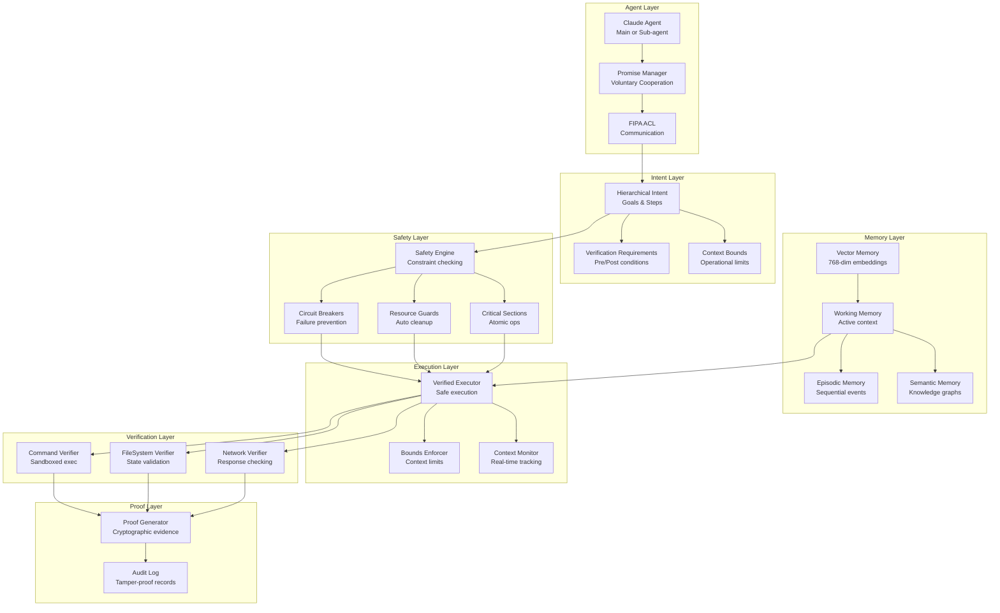

# Synapsed Intent Verification System - Complete Architecture

## System Overview

The Synapsed Intent Verification System prevents AI agents from:
1. **Context Escaping** - Breaking out of defined operational boundaries
2. **False Claims** - Making unverified claims about actions
3. **Unverified Execution** - Running commands without verification

## Enhanced Architecture with Promise Theory & Memory



## Core Components

### 1. Intent Declaration (synapsed-intent/src/intent.rs)

```rust
pub struct HierarchicalIntent {
    pub id: IntentId,
    pub goal: String,                    // What the agent claims it will do
    pub steps: Vec<Step>,                 // How it will do it
    pub sub_intents: Vec<HierarchicalIntent>, // Delegated tasks
    pub config: ExecutionConfig,         // Execution parameters
    pub bounds: ContextBounds,           // Operational limits
    pub status: Arc<RwLock<IntentStatus>>,
}

pub struct Step {
    pub id: Uuid,
    pub name: String,
    pub action: StepAction,              // Command, Function, or Delegate
    pub preconditions: Vec<Condition>,   // Must be true before
    pub postconditions: Vec<Condition>,  // Must be true after
    pub verification: Option<VerificationRequirement>,
}
```

### 2. Context Management (synapsed-intent/src/context.rs)

```rust
pub struct IntentContext {
    id: Uuid,
    parent: Option<Arc<IntentContext>>,  // Hierarchical contexts
    variables: Arc<RwLock<HashMap<String, Value>>>,
    bounds: ContextBounds,               // Restrictions
    audit_log: Arc<RwLock<Vec<AuditEntry>>>,
}

pub struct ContextBounds {
    pub allowed_paths: Vec<String>,      // File system restrictions
    pub allowed_commands: Vec<String>,   // Command whitelist
    pub allowed_endpoints: Vec<String>,  // Network restrictions
    pub max_memory_bytes: Option<usize>,
    pub max_cpu_seconds: Option<u64>,
}
```

### 3. Verified Execution (synapsed-intent/src/execution.rs)

```rust
pub struct VerifiedExecutor {
    command_verifier: Box<dyn CommandVerifierTrait>,
    fs_verifier: Box<dyn FileSystemVerifierTrait>,
    network_verifier: Box<dyn NetworkVerifierTrait>,
    state_verifier: Box<dyn StateVerifierTrait>,
    proof_generator: Box<dyn ProofGeneratorTrait>,
    bounds_enforcer: BoundsEnforcer,
    trust_scores: Arc<RwLock<HashMap<String, f64>>>,
}
```

### 4. Verification Interfaces (synapsed-intent/src/verification.rs)

```rust
#[async_trait]
pub trait CommandVerifierTrait {
    async fn verify(
        &self,
        command: &str,
        args: Option<&[&str]>,
        expected: Option<&serde_json::Value>,
    ) -> Result<CommandVerification>;
}

pub struct CommandVerification {
    pub exit_code: i32,
    pub stdout: String,
    pub stderr: String,
    pub sandboxed: bool,
    pub duration_ms: u64,
}
```

## Data Flow

### Step 1: Intent Declaration
```
Claude Agent → IntentBuilder → HierarchicalIntent
                    ↓
            Adds verification requirements
                    ↓
            Sets context bounds
```

### Step 2: Context Creation
```
ContextBuilder → IntentContext
        ↓
  Sets allowed operations
        ↓
  Injects variables
        ↓
  Creates audit log
```

### Step 3: Execution Planning
```
HierarchicalIntent → ExecutionPlan
         ↓
  Dependency resolution
         ↓
  Parallelization analysis
         ↓
  Step ordering
```

### Step 4: Verified Execution
```
For each step:
  1. Check context bounds
  2. Verify preconditions
  3. Create checkpoint
  4. Execute action
  5. Verify output
  6. Check postconditions
  7. Generate proof
  8. Update metrics
```

### Step 5: Rollback (if needed)
```
Failure detected → CheckpointManager
                        ↓
                 Restore state
                        ↓
                 Cleanup resources
```

## Security Mechanisms

### 1. Context Boundary Enforcement
- **Before execution**: Checks if command/path/network is allowed
- **During execution**: Real-time monitoring for violations
- **After execution**: Audit log for forensics

### 2. Multi-Layer Verification
- **Command Layer**: Sandboxed execution, output verification
- **File System Layer**: Snapshot comparison, hash verification
- **Network Layer**: Response validation, endpoint checking
- **State Layer**: System state verification

### 3. Cryptographic Proofs
- Pre/post state hashing
- Tamper-proof evidence chain
- Signature generation for non-repudiation

## Promise Theory Integration

The system implements voluntary cooperation based on Mark Burgess's Promise Theory:

### Voluntary Promises
```rust
// Agents evaluate willingness before making promises
let willingness = evaluator.evaluate_promise_willingness(
    agent_id,
    &promise_type,
    &body,
    &context
).await?;

match willingness {
    Willingness::Willing { confidence } => {
        // Make voluntary promise
        let promise = agent.make_promise(
            PromiseType::Offer,
            scope,
            body
        ).await?;
    },
    Willingness::Conditional { conditions, .. } => {
        // Negotiate conditions
    },
    Willingness::Unwilling { reason } => {
        // Cannot make this promise
    }
}
```

### FIPA ACL Communication
```rust
// Semantic agent messaging
let message = ACLMessageBuilder::new()
    .performative(Performative::Request)
    .sender(agent_id)
    .receiver(target_agent)
    .content(MessageContent::Promise(promise_body))
    .conversation(conv_id)
    .protocol(InteractionProtocol::ContractNet)
    .build()?;
```

## Memory Architecture Integration

The system includes a hybrid memory architecture for agent learning:

```rust
pub struct HybridMemory {
    pub vector: VectorMemory,      // 768-dimensional embeddings
    pub episodic: EpisodicMemory,  // Sequential experience storage
    pub semantic: SemanticMemory,  // Knowledge graphs
    pub working: WorkingMemory,    // Active context with attention
}

// Memory consolidation
memory.consolidate().await?;  // Transfer working → long-term
```

## Adaptive Permission System

Trust-based permission negotiation that learns from agent behavior:

```rust
let negotiator = AdaptivePermissionNegotiator::new(
    base_negotiator,
    memory
);

// Process request with adaptive trust scoring
let response = negotiator.process_adaptive_request(request).await?;

// Update trust based on outcome
negotiator.update_from_outcome(
    request_id,
    DecisionOutcome {
        was_correct: true,
        actual_usage,
        violations: vec![],
    }
).await?;
```

## Safety Integration

Mathematical safety guarantees through synapsed-safety:

```rust
let safe_executor = SafeVerifiedExecutor::new(executor).await?;

// Execute with circuit breakers and automatic rollback
let result = safe_executor.execute_safe(&intent).await?;

// Critical section for atomic operations
let result = safe_executor.execute_critical(
    &intent,
    Duration::from_secs(30)
).await?;
```

## Observability Integration

All operations emit events through Substrates:

```rust
Event types:
- intent.started
- intent.step.started
- intent.step.completed
- intent.verification.performed
- intent.violation.detected
- intent.completed
- promise.made
- promise.fulfilled
- promise.broken
- memory.consolidated
- trust.updated
```

## Key Safety Properties

1. **No Unverified Claims**: Every claim must have verification evidence
2. **No Context Escaping**: Operations outside bounds are blocked
3. **No Hidden Actions**: All actions are logged and observable
4. **Rollback Safety**: Can recover from any failure point
5. **Trust Tracking**: Agent reputation affects verification requirements
6. **Voluntary Cooperation**: Agents cannot be coerced, only make voluntary promises
7. **Memory-Based Learning**: Adaptive behavior based on past experiences
8. **Circuit Breaker Protection**: Prevents cascade failures in multi-agent systems