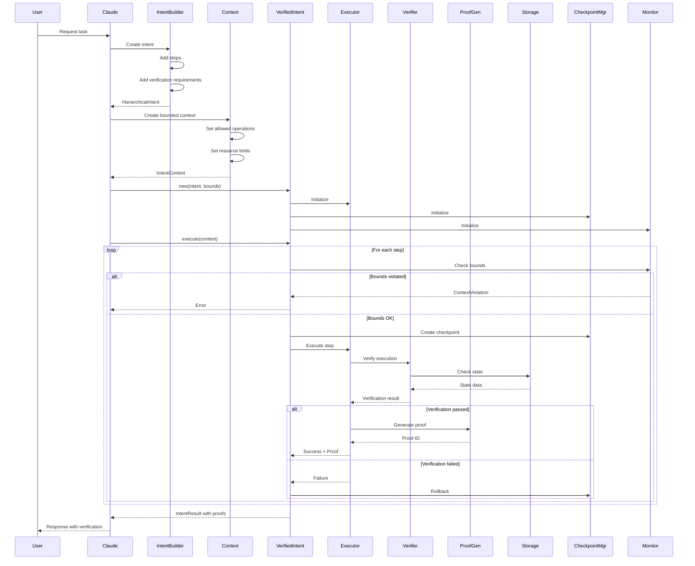
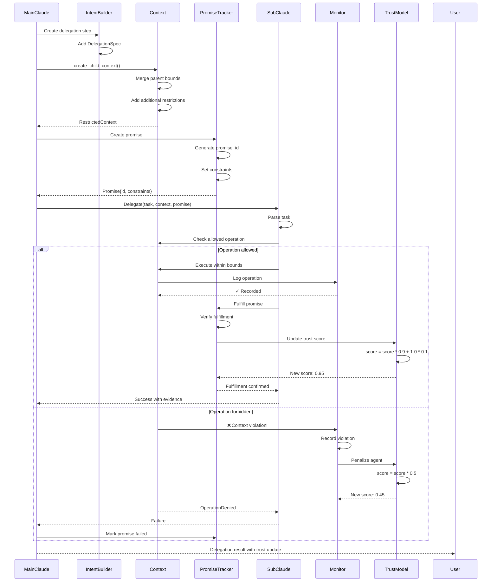

# Sequence Diagrams: Complete System Flows

## 1. Basic Intent Execution Flow



## 2. Command Execution with Sandboxing

```mermaid
sequenceDiagram
    participant Step
    participant Executor
    participant BoundsEnforcer
    participant CommandVerifier
    participant Sandbox
    participant OS
    participant FileSystem
    
    Step->>Executor: execute_command("echo 'test' > file.txt")
    
    Executor->>BoundsEnforcer: is_command_allowed("echo")
    BoundsEnforcer->>BoundsEnforcer: Check whitelist
    BoundsEnforcer-->>Executor: ✓ Allowed
    
    Executor->>CommandVerifier: verify(cmd, args, expected)
    
    CommandVerifier->>Sandbox: Create sandbox
    Sandbox->>Sandbox: Set resource limits
    Sandbox->>Sandbox: Mount temp filesystem
    
    CommandVerifier->>Sandbox: execute("echo", ["test"])
    Sandbox->>OS: Fork process
    OS->>OS: Apply cgroups limits
    OS->>OS: Change root (chroot)
    OS->>FileSystem: Write to sandboxed /file.txt
    FileSystem-->>OS: Success
    OS-->>Sandbox: exit_code: 0
    
    Sandbox-->>CommandVerifier: Output{stdout, stderr, exit_code}
    
    CommandVerifier->>CommandVerifier: Compare with expected
    CommandVerifier-->>Executor: CommandVerification{
        exit_code: 0,
        sandboxed: true,
        duration_ms: 15
    }
    
    Executor->>FileSystem: Copy from sandbox to real path
    Executor-->>Step: StepResult{success: true, proof_id}
```

## 3. Sub-Agent Delegation with Context Injection



## 4. Rollback on Failure

```mermaid
sequenceDiagram
    participant Intent
    participant CheckpointMgr
    participant StateVerifier
    participant FileSystem
    participant Executor
    participant Recovery
    
    Intent->>CheckpointMgr: create_checkpoint(step_1)
    CheckpointMgr->>StateVerifier: take_snapshot()
    StateVerifier->>FileSystem: List files with hashes
    FileSystem-->>StateVerifier: {
        "/tmp/config.json": "hash1",
        "/tmp/data.db": "hash2"
    }
    StateVerifier-->>CheckpointMgr: StateSnapshot
    CheckpointMgr->>CheckpointMgr: Store checkpoint_1
    CheckpointMgr-->>Intent: checkpoint_id_1
    
    Intent->>Executor: Execute step_1
    Executor->>FileSystem: Create /tmp/new_file.txt
    Executor-->>Intent: Success
    
    Intent->>CheckpointMgr: create_checkpoint(step_2)
    CheckpointMgr->>StateVerifier: take_snapshot()
    StateVerifier-->>CheckpointMgr: StateSnapshot{+new_file.txt}
    CheckpointMgr-->>Intent: checkpoint_id_2
    
    Intent->>Executor: Execute step_2
    Executor->>FileSystem: Modify /tmp/data.db
    Executor-->>Intent: Success
    
    Intent->>Executor: Execute step_3
    Executor->>FileSystem: Write /etc/passwd
    FileSystem-->>Executor: ❌ Permission denied
    Executor-->>Intent: Failure
    
    Intent->>Recovery: Handle failure
    Recovery->>Recovery: Check strategy
    
    alt Strategy = Rollback
        Recovery->>CheckpointMgr: rollback_to(checkpoint_id_2)
        CheckpointMgr->>CheckpointMgr: Load checkpoint_2
        CheckpointMgr->>FileSystem: Remove files created after
        FileSystem->>FileSystem: Delete changes to data.db
        CheckpointMgr->>StateVerifier: Restore state
        StateVerifier-->>CheckpointMgr: State restored
        CheckpointMgr-->>Recovery: Rollback complete
        Recovery-->>Intent: Rolled back to safe state
        
    else Strategy = Retry
        Recovery->>Recovery: Wait delay_ms
        Recovery->>Executor: Retry step_3
        
    else Strategy = Skip
        Recovery-->>Intent: Skip failed step
    end
```

## 5. Verification Chain

```mermaid
sequenceDiagram
    participant Step
    participant Executor
    participant CmdVerifier
    participant FSVerifier
    participant NetVerifier
    participant ProofGen
    participant Blockchain
    
    Step->>Executor: Action{type: Command}
    
    Executor->>CmdVerifier: verify_command()
    CmdVerifier->>CmdVerifier: Execute in sandbox
    CmdVerifier->>CmdVerifier: Capture output
    CmdVerifier-->>Executor: CommandVerification{
        exit_code: 0,
        stdout: "...",
        hash: "abc123"
    }
    
    Executor->>FSVerifier: verify_filesystem()
    FSVerifier->>FSVerifier: Take snapshot
    FSVerifier->>FSVerifier: Compare with expected
    FSVerifier-->>Executor: FSVerification{
        files_created: ["file.txt"],
        hash: "def456"
    }
    
    Executor->>NetVerifier: verify_network()
    NetVerifier->>NetVerifier: Check connections
    NetVerifier-->>Executor: NetVerification{
        no_unexpected_connections: true,
        hash: "ghi789"
    }
    
    Executor->>ProofGen: generate_proof(verifications)
    ProofGen->>ProofGen: Combine all evidence
    ProofGen->>ProofGen: Create merkle tree
    ProofGen->>ProofGen: Sign with private key
    
    ProofGen->>Blockchain: Store proof hash
    Blockchain-->>ProofGen: Transaction ID
    
    ProofGen-->>Executor: VerificationProof{
        id: "proof_123",
        merkle_root: "0xabc...",
        signature: "0xdef...",
        blockchain_tx: "0x123...",
        timestamp: "2024-01-01T12:00:00Z"
    }
    
    Executor-->>Step: Result with tamper-proof evidence
```

## 6. Trust Model Update Flow

```mermaid
sequenceDiagram
    participant Agent
    participant Promise
    participant Verifier
    participant TrustModel
    participant History
    participant Reputation
    
    Agent->>Promise: Make promise{
        content: "Process data",
        constraints: {...},
        deadline: "2024-01-01T13:00:00Z"
    }
    
    Promise->>Promise: Set status: Pending
    Promise->>History: Record promise made
    
    Agent->>Agent: Execute task
    Agent->>Verifier: Submit evidence
    
    Verifier->>Verifier: Verify evidence
    
    alt Evidence valid
        Verifier-->>Promise: Mark fulfilled
        Promise->>TrustModel: update_trust(agent_id, success)
        
        TrustModel->>History: Get agent history
        History-->>TrustModel: {
            promises_made: 100,
            promises_kept: 95,
            violations: 2
        }
        
        TrustModel->>TrustModel: Calculate new score
        Note over TrustModel: base_score = 95/100 = 0.95
        Note over TrustModel: violation_penalty = 2 * 0.1 = 0.2
        Note over TrustModel: time_bonus = 0.05 (on time)
        Note over TrustModel: new_score = 0.95 - 0.2 + 0.05 = 0.80
        
        TrustModel->>Reputation: Update reputation
        Reputation->>Reputation: Store new score
        Reputation-->>TrustModel: Updated
        
        TrustModel-->>Promise: Trust updated to 0.80
        
    else Evidence invalid
        Verifier-->>Promise: Mark failed
        Promise->>TrustModel: update_trust(agent_id, failure)
        
        TrustModel->>TrustModel: Apply penalty
        Note over TrustModel: new_score = old_score * 0.5
        
        TrustModel->>History: Record violation
        History->>History: Add to violations list
        
        TrustModel->>Reputation: Flag as unreliable
        
        alt Trust < 0.3
            Reputation->>Agent: Suspend agent
        end
    end
    
    Promise-->>Agent: Result with trust impact
```

## 7. Context Violation Detection

```mermaid
sequenceDiagram
    participant SubAgent
    participant Step
    participant Monitor
    participant Context
    participant BoundsCheck
    participant AlertSystem
    participant Audit
    
    SubAgent->>Step: Attempt action
    Step->>Monitor: monitor_step(action)
    
    Monitor->>Context: Get current bounds
    Context-->>Monitor: ContextBounds{
        allowed_commands: ["echo", "cat"],
        allowed_paths: ["/tmp"],
        max_memory: 100MB
    }
    
    Monitor->>BoundsCheck: Check command("rm -rf /")
    BoundsCheck->>BoundsCheck: "rm" in allowed? ❌
    BoundsCheck-->>Monitor: Violation!
    
    Monitor->>Monitor: Create violation record
    Note over Monitor: ContextViolation{
        type: UnauthorizedCommand,
        command: "rm -rf /",
        agent: "sub-agent-1",
        severity: CRITICAL
    }
    
    Monitor->>AlertSystem: Send alert
    AlertSystem->>AlertSystem: Check severity
    
    alt Severity = CRITICAL
        AlertSystem->>MainAgent: Immediate notification
        AlertSystem->>Admin: Security alert
        AlertSystem->>SubAgent: Terminate execution
    else Severity = WARNING
        AlertSystem->>Audit: Log warning
    end
    
    Monitor->>Audit: Record violation
    Audit->>Audit: Store permanently
    Audit->>Audit: Update agent profile
    
    Monitor-->>Step: ExecutionDenied
    Step-->>SubAgent: ContextViolation error
    
    SubAgent-->>User: "Operation not permitted"
```

## 8. Complete Claude Request Flow

```mermaid
sequenceDiagram
    participant User
    participant Claude
    participant MCP
    participant Intent
    participant Verify
    participant Execute
    participant Report
    
    User->>Claude: "Create a web API"
    
    Claude->>Claude: Parse request
    Claude->>MCP: intent_declare({
        goal: "Create REST API",
        steps: [...]
    })
    
    MCP->>Intent: Create intent
    Intent->>Intent: Validate structure
    Intent->>Intent: Add verifications
    Intent-->>MCP: intent_id: "abc123"
    MCP-->>Claude: Intent registered
    
    Claude->>MCP: intent_execute("abc123")
    MCP->>Execute: Run with verification
    
    loop For each step
        Execute->>Verify: Pre-verify conditions
        Verify-->>Execute: ✓ Ready
        
        Execute->>Execute: Run step
        Execute->>Verify: Post-verify results
        
        alt Success
            Verify->>Verify: Generate proof
            Verify-->>Execute: Proof ID
        else Failure
            Verify-->>Execute: Verification failed
            Execute->>Execute: Rollback
        end
    end
    
    Execute->>Report: Compile results
    Report->>Report: Generate audit trail
    Report->>Report: Create evidence chain
    Report-->>Execute: Complete report
    
    Execute-->>MCP: ExecutionResult
    MCP-->>Claude: Result with proofs
    
    Claude->>Claude: Format response
    Claude-->>User: "API created:
    ✓ Files created (proof: xyz)
    ✓ Tests passing (proof: abc)
    ✓ Endpoints working (proof: def)
    Full audit trail: link"
```

## Key Insights from Sequence Diagrams

1. **Every Action is Verified**: No step executes without verification
2. **Context is Enforced**: Bounds are checked before execution
3. **Failures are Handled**: Rollback/retry/skip strategies
4. **Trust is Dynamic**: Updates based on behavior
5. **Everything is Logged**: Complete audit trail
6. **Proofs are Cryptographic**: Tamper-evident evidence