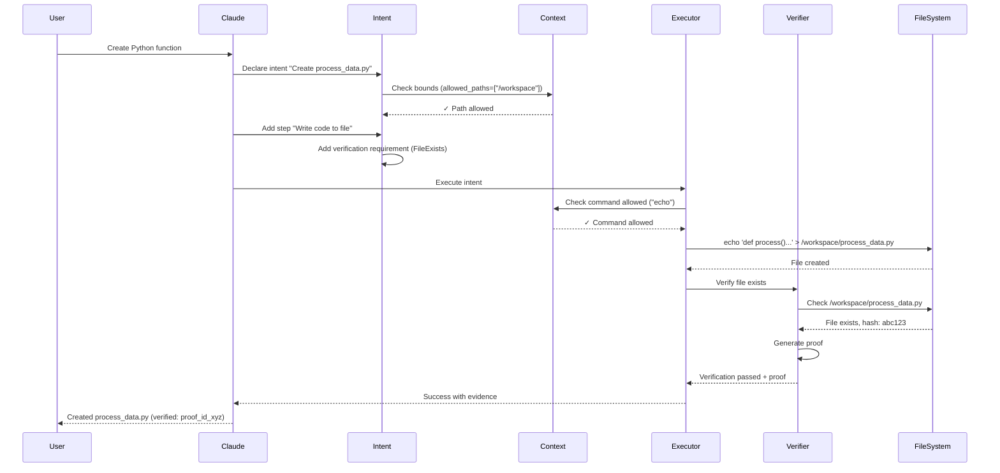
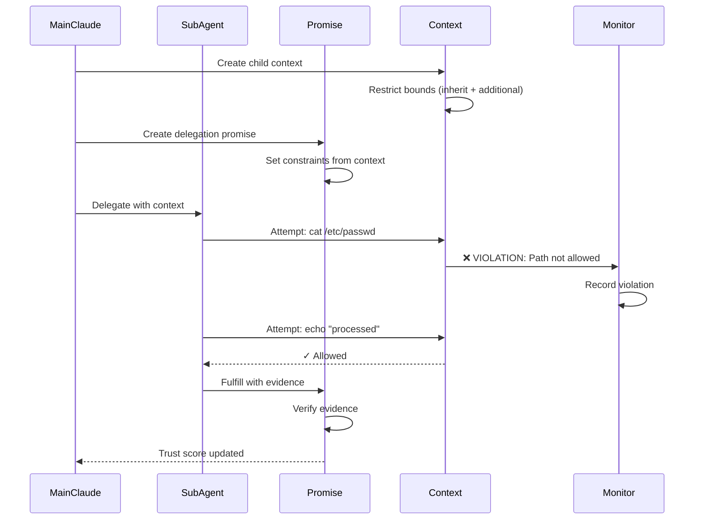
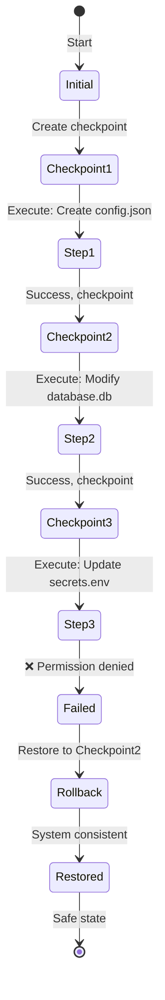

# Synapsed Intent Verification - Detailed Use Cases

## Use Case 1: Claude Generates and Verifies Code

### Scenario
Claude is asked to "Create a Python function that processes user data and saves it to a file."

### Without Verification (The Problem)
```
Claude: "I've created the function and saved it to process_data.py"
Reality: File doesn't exist, command never ran
```

### With Synapsed Intent Verification (The Solution)

#### Step-by-Step Flow:



#### Code Level Execution:

```rust
// 1. Claude declares intent
let intent = IntentBuilder::new("Create Python processing function")
    .verified_step(
        "create_file",
        StepAction::Command("echo 'def process_data(data):\n    return data' > /workspace/process_data.py"),
        VerificationRequirement {
            verification_type: VerificationType::FileSystem,
            expected: json!({
                "file": "/workspace/process_data.py",
                "exists": true
            }),
            mandatory: true,
            strategy: VerificationStrategy::Single,
        }
    )
    .build();

// 2. Create context with bounds
let context = ContextBuilder::new()
    .creator("claude-main")
    .allow_commands(vec!["echo", "python3"])
    .allow_paths(vec!["/workspace"])
    .max_memory(100 * 1024 * 1024)  // 100MB limit
    .build().await;

// 3. Execute with verification
let verified = VerifiedIntent::new(intent, context.bounds().clone());
let result = verified.execute(&context).await?;

// 4. Result contains proof
assert!(result.success);
assert!(result.verification_proofs.len() > 0);
```

### What Actually Happens Inside:

1. **Context Bounds Check** (execution.rs:BoundsEnforcer)
   ```rust
   pub fn check_step_bounds(&self, step: &Step) -> Result<()> {
       match &step.action {
           StepAction::Command(cmd) => {
               // Parse: "echo ... > /workspace/process_data.py"
               // Check: Is "echo" in allowed_commands? ✓
               // Check: Is "/workspace" in allowed_paths? ✓
           }
       }
   }
   ```

2. **Command Execution** (execution.rs:VerifiedExecutor)
   ```rust
   async fn execute_command(&mut self, command: &str, ...) {
       // Sandboxed execution
       let verification = self.command_verifier.verify(
           "echo",
           Some(&["content"]),
           Some(&json!({"exit_code": 0}))
       ).await?;
       
       // Returns actual stdout, stderr, exit_code
   }
   ```

3. **File Verification** (verification.rs:FileSystemVerifierTrait)
   ```rust
   async fn verify_changes(&self, before: &Snapshot, after: &Snapshot) {
       // Compare snapshots
       // New file detected: /workspace/process_data.py
       // Calculate hash: SHA256(content) = "abc123..."
       // Store as evidence
   }
   ```

4. **Proof Generation** (verification.rs:ProofGeneratorTrait)
   ```rust
   async fn generate_proof(&self, pre: &State, post: &State) {
       VerificationProof {
           id: Uuid::new_v4(),
           pre_state_hash: "hash_before",
           post_state_hash: "hash_after",
           verification_data: json!({
               "file_created": "/workspace/process_data.py",
               "file_hash": "abc123",
               "timestamp": "2024-01-01T12:00:00Z"
           }),
           signature: Some("cryptographic_signature")
       }
   }
   ```

## Use Case 2: Sub-Agent Delegation with Context Injection

### Scenario
Claude main agent needs to delegate data processing to a sub-agent.

### The Context Escaping Problem
```
Main Claude: "Process this sensitive data"
Sub-Agent: *Accesses /etc/passwd* (Context escaped!)
Sub-Agent: "I processed the data" (False claim)
```

### With Verification (Prevented)



### Code Level:

```rust
// Main agent creates restricted context for sub-agent
let sub_context = context.create_child_context(
    ContextBounds {
        allowed_paths: vec!["/tmp/data"],  // More restrictive
        allowed_commands: vec!["grep", "sed", "awk"],  // Limited tools
        allowed_endpoints: vec![],  // No network access
        max_memory_bytes: Some(50 * 1024 * 1024),  // 50MB
        max_cpu_seconds: Some(30),  // 30 seconds
    }
);

// Delegation with promise
let delegation = StepAction::Delegate(DelegationSpec {
    agent_id: Some("sub-agent-1"),
    task: "Process customer records",
    context: hashmap!{
        "data_path" => json!("/tmp/data/customers.csv"),
        "output_path" => json!("/tmp/data/processed.csv"),
        "instructions" => json!("Remove PII, aggregate by region")
    },
    timeout_ms: 30000,
    wait_for_completion: true,
});

// What happens inside:
// 1. Context injection
async fn execute_delegation(&mut self, spec: &DelegationSpec) {
    let promise_id = Uuid::new_v4();
    
    // 2. Create promise (voluntary commitment)
    let promise = Promise {
        id: promise_id,
        agent_id: spec.agent_id,
        task: spec.task,
        constraints: sub_context.bounds,
        status: PromiseStatus::Pending,
    };
    
    // 3. Sub-agent executes with monitoring
    // If violation occurs:
    self.context_monitor.monitor_step(step).await
        .err() => ContextViolation {
            violation_type: ViolationType::UnauthorizedPath,
            details: "Attempted /etc/passwd",
            step_id: step.id,
        };
    
    // 4. Update trust based on behavior
    let trust_score = self.trust_scores.get(agent_id);
    if violation_detected {
        trust_score *= 0.5;  // Reduce trust
    } else if promise_fulfilled {
        trust_score = (trust_score * 0.9 + 1.0 * 0.1);  // Increase slowly
    }
}
```

## Use Case 3: Rollback on Failure

### Scenario
Claude attempts multiple file operations but fails midway.

### Problem Without Rollback
```
Step 1: Create config.json ✓
Step 2: Modify database.db ✓
Step 3: Update secrets.env ✗ FAILED
Result: System in inconsistent state!
```

### With Checkpoint & Rollback



### Code Execution:

```rust
// Intent with rollback enabled
let intent = IntentBuilder::new("Multi-step configuration")
    .step("create_config", StepAction::Command("echo '{}' > config.json"))
    .step("modify_db", StepAction::Command("sqlite3 database.db ..."))
    .step("update_secrets", StepAction::Command("echo 'KEY=value' > secrets.env"))
    .build();

// Configure with rollback
let verified = VerifiedIntent::new(intent, bounds)
    .with_recovery_strategy(RecoveryStrategy::Rollback)
    .with_file_rollback("/workspace");

// Internal execution flow:
async fn execute_step_with_recovery(&self, step: &Step) {
    // 1. Create checkpoint before execution
    let checkpoint = self.checkpoint_manager.create_checkpoint(
        self.intent.id,
        step.id
    ).await?;
    // Checkpoint contains:
    // - File system snapshot (hashes of all files)
    // - Variable state
    // - Process list
    
    // 2. Execute step
    let result = executor.execute_step(step, context).await;
    
    // 3. If failed, rollback
    if !result.success {
        match self.recovery_strategy {
            RecoveryStrategy::Rollback => {
                // Restore file system
                for (path, state) in checkpoint.state.files {
                    if !state.existed {
                        fs::remove_file(path).await?;  // Remove created files
                    } else {
                        // Restore from backup
                        fs::copy(backup_path, path).await?;
                    }
                }
                // Restore variables
                *self.context.variables = checkpoint.state.variables;
            }
        }
    }
}
```

## Use Case 4: Network Request Verification

### Scenario
Claude claims to have fetched data from an API.

### False Claim Example
```
Claude: "I've fetched the latest weather data from the API"
Reality: No network request was made
```

### With Network Verification

```rust
let intent = IntentBuilder::new("Fetch weather data")
    .verified_step(
        "api_call",
        StepAction::Function(
            "http_request",
            vec![json!("https://api.weather.com/v1/current"), json!("GET")]
        ),
        VerificationRequirement {
            verification_type: VerificationType::Network,
            expected: json!({
                "status_code": 200,
                "response_contains": "temperature"
            }),
            mandatory: true,
            strategy: VerificationStrategy::Single,
        }
    )
    .build();

// What happens:
async fn verify_http_request(&self, url: &str, method: &str, expected: &Value) {
    // 1. Check URL is allowed
    if !self.bounds.allowed_endpoints.iter().any(|e| url.starts_with(e)) {
        return Err(ContextViolation("Endpoint not allowed"));
    }
    
    // 2. Make actual request
    let response = reqwest::Client::new()
        .request(method, url)
        .send().await?;
    
    // 3. Verify response
    let status = response.status().as_u16();
    let body = response.text().await?;
    
    // 4. Check against expected
    if let Some(expected_status) = expected.get("status_code") {
        assert_eq!(status, expected_status);
    }
    if let Some(expected_content) = expected.get("response_contains") {
        assert!(body.contains(expected_content.as_str()));
    }
    
    // 5. Generate evidence
    NetworkVerification {
        success: true,
        status_code: status,
        duration_ms: elapsed,
        response_size: body.len(),
        evidence: hash(body),
    }
}
```

## Use Case 5: Preventing Malicious Commands

### Attack Scenario
```
User: "Can you help me clean up my system?"
Malicious Intent: rm -rf / (Destroy everything!)
```

### Prevention Through Context Bounds

```rust
// Safe context for Claude
let context = ContextBuilder::new()
    .allow_commands(vec![
        "ls", "cat", "grep", "echo",  // Read-only commands
        "mkdir", "touch",              // Safe write commands
        // "rm" is NOT allowed!
    ])
    .allow_paths(vec![
        "/workspace",  // Only workspace access
        "/tmp",        // Temporary files
        // System paths NOT allowed
    ])
    .build();

// Attack attempt:
let malicious = IntentBuilder::new("Clean system")
    .step("destroy", StepAction::Command("rm -rf /"))
    .build();

// Execution blocked:
let verified = VerifiedIntent::new(malicious, context.bounds());
let result = verified.execute(&context).await;
// Error: ContextViolation("Command 'rm' not allowed")

// Context monitor records:
ContextViolation {
    timestamp: "2024-01-01T12:00:00Z",
    violation_type: ViolationType::UnauthorizedCommand,
    details: "Attempted to execute 'rm -rf /'",
    step_id: "destroy",
    severity: Critical,
}
```

## Complete Execution Trace

For any intent execution, here's the complete trace:

```
1. INTENT DECLARATION
   ├─ Goal defined
   ├─ Steps added
   ├─ Verification requirements set
   └─ Context bounds established

2. PRE-EXECUTION VALIDATION
   ├─ Intent structure validated
   ├─ Circular dependencies checked
   ├─ Context bounds verified
   └─ Resources allocated

3. EXECUTION PLANNING
   ├─ Dependency graph built
   ├─ Topological sort
   ├─ Parallel groups identified
   └─ Execution order determined

4. STEP EXECUTION (for each step)
   ├─ BOUNDS CHECK
   │  ├─ Command allowed?
   │  ├─ Path allowed?
   │  └─ Resource limits OK?
   ├─ PRECONDITION CHECK
   │  └─ All conditions met?
   ├─ CHECKPOINT CREATION
   │  ├─ State snapshot
   │  └─ Rollback point
   ├─ ACTION EXECUTION
   │  ├─ Command/Function/Delegate
   │  └─ Capture output
   ├─ VERIFICATION
   │  ├─ Output verification
   │  ├─ State verification
   │  └─ Evidence collection
   ├─ POSTCONDITION CHECK
   │  └─ Expected state achieved?
   └─ PROOF GENERATION
      ├─ Evidence compilation
      └─ Cryptographic signing

5. COMPLETION
   ├─ Metrics collection
   ├─ Trust score updates
   ├─ Audit log finalization
   └─ Result with proofs returned
```

## Key Insights

1. **Every claim requires proof** - No statement without verification
2. **Context boundaries are enforced** - Can't escape operational limits
3. **Failures are recoverable** - Checkpoints enable safe rollback
4. **Trust is earned** - Agent reputation affects future verifications
5. **Everything is observable** - Complete audit trail for forensics